# Projet final - Mini SI d’un organisme de formation

## APIs, intégration de vrais logiciels open source, concurrence, idempotence, messaging et résilience

**Type :** projet de synthèse  
**Niveau :** M1 / M2 / MSc - intermédiaire à avancé  
**Travail conseillé :** groupes de 2 à 4 étudiants  
**Durée indicative :** 4 à 5 heures par groupe  
**Environnement :** Docker / Docker Compose  
**Langage du composant d’intégration :** Python + FastAPI recommandé, Java/Spring Boot accepté si le groupe le maîtrise  
**Objectif :** construire un **mini système d’information réellement distribué**, composé de plusieurs logiciels existants et de services développés par les étudiants.

---

# 1. Contexte

Vous travaillez pour un organisme de formation appelé **OpenTraining**.

L’entreprise utilise plusieurs systèmes indépendants :

- **ERPNext** pour la gestion commerciale et administrative ;
- **Moodle** pour l’apprentissage en ligne ;
- **RabbitMQ** comme broker de messages ;
- **PostgreSQL** pour stocker l’état du processus d’intégration ;
- un service développé par votre équipe appelé **Integration Hub**.

**ERPNext** joue dans ce projet deux rôles :

- **CRM** : prospects, contacts, clients ;
- **ERP** : facturation et données administratives.

**Moodle** reste le système responsable :

- des utilisateurs apprenants ;
- des cours ;
- des inscriptions aux cours.

Vous n’avez pas le droit d’accéder directement aux bases de données internes de Moodle ou ERPNext.

Les échanges avec ces composants doivent passer par leurs **APIs officielles**.

---

# 2. Problème métier

Un client souhaite inscrire un apprenant à une session de formation.

**Une inscription doit déclencher plusieurs opérations** :

1. vérifier qu’il reste une place dans la session ;
2. enregistrer la demande ;
3. créer ou retrouver le prospect/client dans ERPNext ;
4. créer ou retrouver l’utilisateur dans Moodle ;
5. inscrire l’utilisateur au bon cours Moodle ;
6. créer une trace administrative dans ERPNext ;
7. notifier l’apprenant ;
8. conserver un état permettant de diagnostiquer les erreurs.

**Le SI doit continuer à fonctionner correctement même en présence de** :

- requêtes HTTP envoyées deux fois ;
- deux utilisateurs essayant de prendre la dernière place simultanément ;
- timeout Moodle ;
- indisponibilité ERPNext ;
- redélivrance RabbitMQ ;
- crash d’un worker ;
- message non traitable ;
- démarrage de plusieurs workers concurrents.

---

# 3. Architecture imposée

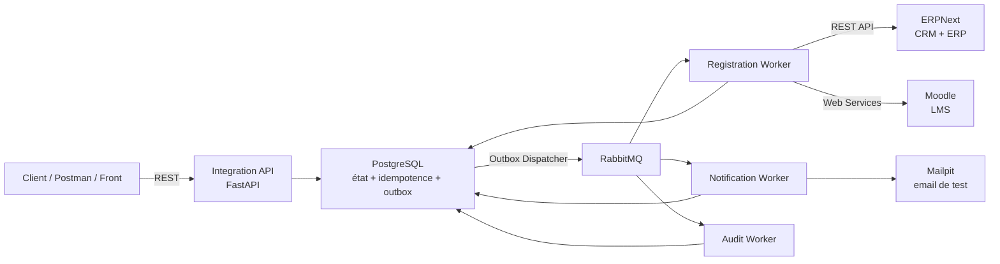

---

# 4. Composants obligatoires

## 4.1 ERPNext

ERPNext est un ERP open source basé sur **Frappe**.

**Dans ce projet, vous utiliserez au minimum** :

- `Lead` ou `Customer` pour la partie **CRM** ;
- un document administratif de votre choix pour la partie **ERP** :
  - `Sales Order`,
  - `Sales Invoice`,
  - ou un DocType approprié à votre scénario.

L’**API Frappe** expose des opérations **REST CRUD** sur les **DocTypes**.

**Exemple conceptuel** :

```http
POST /api/resource/Lead
GET  /api/resource/Customer/{id}
PUT  /api/resource/Customer/{id}
```

Vous devez utiliser l’API et **ne jamais écrire directement dans la base ERPNext**.

## 4.2 Moodle

**Moodle** joue le rôle de **LMS**.

**Vous devez utiliser les Web Services Moodle pour au minimum** :

- rechercher un utilisateur ;
- créer un utilisateur si nécessaire ;
- inscrire l’utilisateur à un cours.

Fonctions typiquement utilisables :

```text
core_user_get_users_by_field
core_user_create_users
enrol_manual_enrol_users
```

Votre groupe doit documenter les fonctions réellement utilisées.

## 4.3 RabbitMQ

**RabbitMQ** sert à découpler les traitements.

**Vous devez créer au minimum** :

```text
1 exchange
3 queues métier
1 DLQ
```

**Proposition** :

```text
exchange : si.events

queues :
registration.orchestrator
notifications
audit
registration.dlq
```

**Routing keys possibles** :

```text
registration.accepted
registration.confirmed
registration.failed
registration.compensated
notification.requested
```

## 4.4 PostgreSQL

**PostgreSQL** est **votre base d’intégration**.

**Vous pouvez y stocker** :

- inscriptions ;
- sessions ;
- capacités ;
- clés d’idempotence ;
- mappings entre **IDs internes / ERPNext / Moodle** ;
- événements **Outbox** ;
- messages déjà traités ;
- historique des états.

Vous ne devez pas remplacer **Moodle** ou **ERPNext** par **PostgreSQL** comme dans les **TPs**.

**PostgreSQL** sert à coordonner le **SI**.

---

# 5. API à développer

## 5.1 Créer une inscription

```http
POST /api/v1/registrations
```

**Header obligatoire** :

```http
Idempotency-Key: <uuid-ou-chaîne-unique>
```

**Body** :

```json
{
  "student": {
    "email": "alice@example.org",
    "firstName": "Alice",
    "lastName": "Martin"
  },
  "company": {
    "name": "ACME"
  },
  "sessionId": "SESSION-PYTHON-01"
}
```

**Réponse normale** :

```http
202 Accepted
```

```json
{
  "registrationId": "REG-001",
  "status": "ACCEPTED"
}
```

## 5.2 Consultation du statut

```http
GET /api/v1/registrations/{registrationId}
```

**Exemple** :

```json
{
  "registrationId": "REG-001",
  "status": "CONFIRMED",
  "moodleUserId": 45,
  "erpCustomerId": "CUST-0007",
  "courseId": 12
}
```

## 5.3 Catalogue agrégé

**Vous devez également proposer** :

```http
GET /api/v1/catalog
```

Ce endpoint doit montrer un exemple d’**agrégation synchrone**.

**Il peut combiner** :

```text
Moodle
-> nom du cours

PostgreSQL
-> capacité restante

ERPNext
-> tarif / référence commerciale
```

**Exemple** :

```json
[
  {
    "sessionId": "SESSION-PYTHON-01",
    "courseName": "Python avancé",
    "remainingSeats": 4,
    "price": 850
  }
]
```

---

# 6. Idempotence - obligation majeure

Le endpoint :

```http
POST /api/v1/registrations
```

doit être idempotent.

**L’appel suivant** :

```http
Idempotency-Key: abc-123
```

**envoyé deux fois avec le même body ne doit pas créer** :

```text
2 inscriptions
2 utilisateurs Moodle
2 clients ERP
2 factures
```

## 6.1 Table d’idempotence recommandée

```sql
CREATE TABLE api_idempotency (
    idempotency_key VARCHAR(255) PRIMARY KEY,
    request_hash VARCHAR(64) NOT NULL,
    registration_id UUID NOT NULL,
    response_status INTEGER,
    response_body JSONB,
    created_at TIMESTAMPTZ NOT NULL DEFAULT now()
);
```

## 6.2 Même clé + même payload

**Premier appel** :

```http
Idempotency-Key: 1000-A
```

-> création normale.

**Deuxième appel avec la même clé et le même JSON** :

```text
ne crée rien de nouveau
```

**L’API** retourne le même `registrationId`.

## 6.3 Même clé + payload différent

**Même clé mais autre contenu** :

```http
409 Conflict
```

```json
{
  "error": "IDEMPOTENCY_KEY_REUSED_WITH_DIFFERENT_PAYLOAD"
}
```

## 6.4 Diagramme d’idempotence

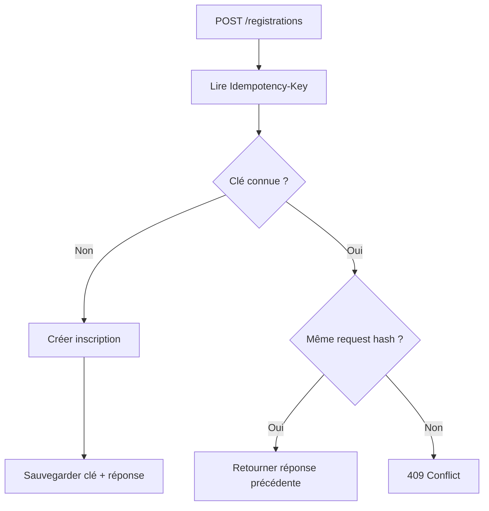

---

# 7. Concurrence - la dernière place

**Créez une session** :

```text
SESSION-CONCURRENCY
capacity = 1
```

Deux requêtes différentes arrivent au même moment avec deux `Idempotency-Key` différentes.

Une seule doit réussir à réserver la place.

## 7.1 Mauvaise implémentation

```python
session = get_session()

if session.remaining_seats > 0:
    session.remaining_seats -= 1
    save(session)
```

Deux processus peuvent lire `remaining_seats = 1` avant qu’un des deux ne sauvegarde.

**Résultat possible** :

```text
2 inscriptions
pour
1 place
```

## 7.2 Solution attendue

Utilisez **une transaction PostgreSQL** et un verrou.

```sql
BEGIN;

SELECT *
FROM training_session
WHERE id = 'SESSION-CONCURRENCY'
FOR UPDATE;

UPDATE training_session
SET remaining_seats = remaining_seats - 1
WHERE id = 'SESSION-CONCURRENCY';

INSERT INTO registration (...);

COMMIT;
```

## 7.3 Test de concurrence obligatoire

**Lancez au minimum** :

```text
20 requêtes concurrentes
```

sur une session de **capacité 1**.

**Attendu** :

```text
1 inscription acceptée
19 refusées
remaining_seats = 0
jamais -1
```

**Exemple de script** :

```python
import asyncio
import uuid
import httpx

URL = "http://localhost:8000/api/v1/registrations"

async def register(i):
    payload = {
        "student": {
            "email": f"user{i}@example.org",
            "firstName": "Test",
            "lastName": str(i)
        },
        "company": {"name": "Concurrent Corp"},
        "sessionId": "SESSION-CONCURRENCY"
    }

    headers = {"Idempotency-Key": str(uuid.uuid4())}

    async with httpx.AsyncClient() as client:
        response = await client.post(URL, json=payload, headers=headers)
        return response.status_code, response.json()

async def main():
    results = await asyncio.gather(*(register(i) for i in range(20)))
    for result in results:
        print(result)

asyncio.run(main())
```

---

# 8. Transaction + Outbox

Lorsqu’une inscription est acceptée, vous devez enregistrer **dans la même transaction PostgreSQL** :

```text
registration
+
outbox_event
```

```sql
BEGIN;

INSERT INTO registration (...);

INSERT INTO outbox_event (
    event_id,
    event_type,
    aggregate_id,
    payload
)
VALUES (...);

COMMIT;
```

## 8.1 Pourquoi l’Outbox ?

**Mauvaise version** :

```text
1. INSERT registration
2. COMMIT
3. publish RabbitMQ
```

**Si le processus plante entre 2 et 3** :

```text
inscription existe
mais
aucun événement n'est publié
```

## 8.2 Outbox correcte

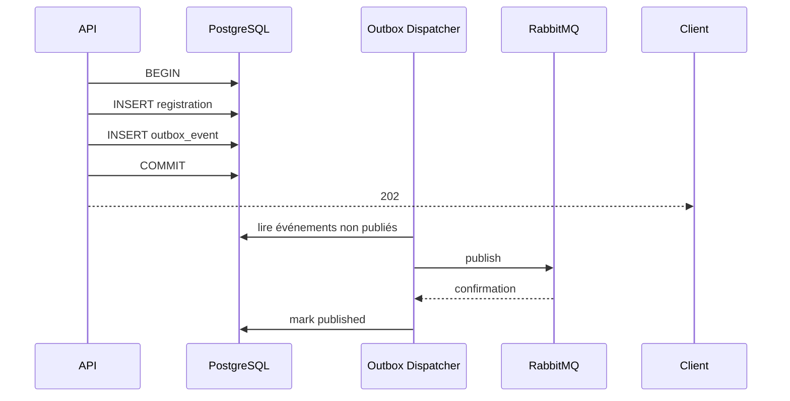

## 8.3 Outbox Dispatcher

**Le worker doit** :

1. lire les événements `published_at IS NULL` ;
2. les publier dans **RabbitMQ** ;
3. attendre la confirmation du broker ;
4. marquer l’événement comme publié.

Vous devez prévoir que ce dispatcher puisse planter.

---

# 9. Livraison au moins une fois et déduplication

**Votre architecture doit supposer** :

```text
un message peut être livré plusieurs fois
```

Tous les consumers doivent donc être idempotents.

**Table recommandée** :

```sql
CREATE TABLE processed_events (
    consumer_name VARCHAR(100) NOT NULL,
    event_id UUID NOT NULL,
    processed_at TIMESTAMPTZ NOT NULL DEFAULT now(),
    PRIMARY KEY (consumer_name, event_id)
);
```

## 9.1 Algorithme consumer idempotent

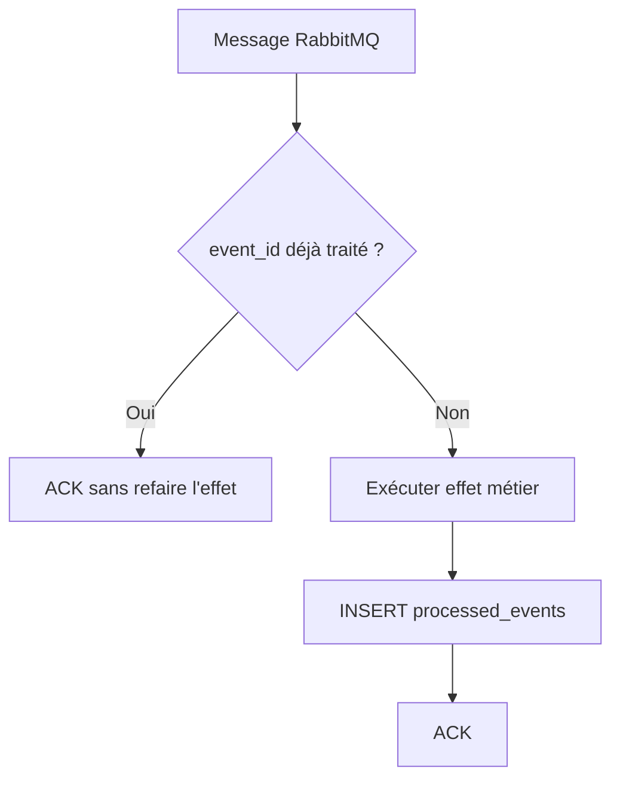

---

# 10. Workflow principal de l’inscription

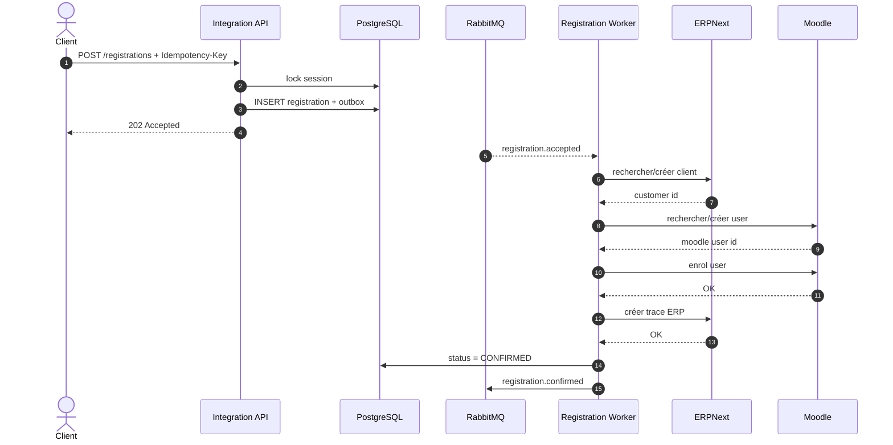

---

# 11. États de l’inscription

**Proposition** :

```text
ACCEPTED
PROCESSING
MOODLE_ENROLLED
ERP_RECORDED
CONFIRMED
RETRYING
COMPENSATING
COMPENSATED
FAILED
```

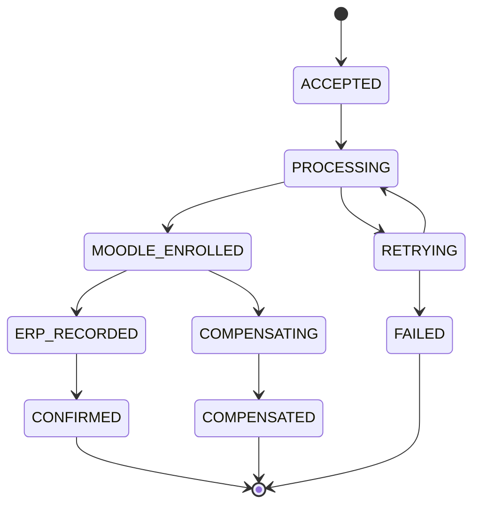

---

# 12. Intégration ERPNext

Votre worker doit utiliser réellement **l’API Frappe/ERPNext**.

**Minimum** :

```text
GET
POST
PUT ou PATCH selon API utilisée
```

**Flux recommandé** :

```text
chercher Lead/Customer par email
|
v
existe ?
├─ oui -> réutiliser
└─ non -> créer
```

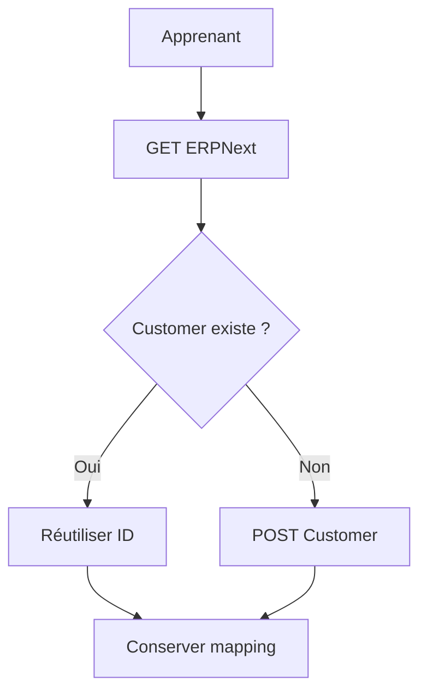

Ne faites pas systématiquement un `POST Customer` à chaque redélivrance.

---

# 13. Intégration Moodle

**Flux recommandé** :

```text
chercher user par email
|
v
si absent : créer
|
v
vérifier inscription au cours
|
v
enrol si nécessaire
```

Un message **RabbitMQ** dupliqué ne doit pas provoquer deux comptes **Moodle**.

Vous devez utiliser une stratégie de recherche sur un champ unique avant création.

---

# 14. Mapping des identifiants

Conservez une table locale.

```sql
CREATE TABLE external_mapping (
    entity_type VARCHAR(50) NOT NULL,
    internal_id UUID NOT NULL,
    system_name VARCHAR(50) NOT NULL,
    external_id VARCHAR(255) NOT NULL,
    UNIQUE (entity_type, internal_id, system_name)
);
```

**Le SI doit pouvoir relier** :

```text
registrationId interne
↔ Moodle user id
↔ Moodle course id
↔ ERPNext Customer id
↔ ERPNext document id
```

---

# 15. Retry et DLQ

**Une erreur temporaire** :

```text
HTTP 503
timeout
connection refused
```

peut être retentée.

**Une erreur permanente** :

```text
HTTP 400
payload invalide
règle métier impossible
```

ne doit pas être retentée indéfiniment.

## 15.1 Backoff

**Exemple** :

```text
tentative 1 -> immédiate
tentative 2 -> +2 s
tentative 3 -> +4 s
tentative 4 -> +8 s
```

## 15.2 DLQ obligatoire

**Après le nombre maximal d’essais** :

```text
message
|
v
registration.dlq
```

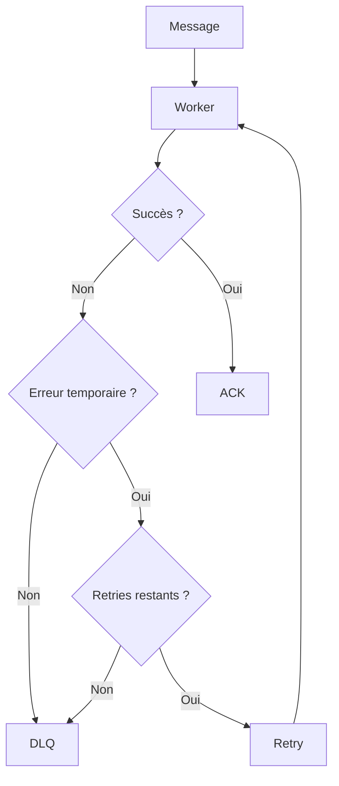

---

# 16. ACK / NACK

Le worker ne doit pas acquitter le message avant la fin du traitement.

```text
receive
|
v
traitement
|
v
succès
|
v
ACK
```

**Erreur** :

```text
receive
|
v
erreur
|
v
retry / NACK / DLQ
```

---

# 17. Test crash obligatoire

**Introduisez un mode** :

```text
CRASH_AFTER_MOODLE=true
```

**Le worker** :

1. inscrit l’utilisateur dans **Moodle** ;
2. plante avant de terminer.

Au redémarrage, le message peut être retraité.

**Attendu** :

```text
aucun deuxième utilisateur Moodle
aucune double inscription
état final cohérent
```

---

# 18. Compensation - Saga simplifiée

Implémentez au moins une compensation.

**Scénario proposé** :

```text
Moodle enrollment réussi
ERPNext échoue définitivement
```

**Après épuisement des retries** :

```text
désinscrire Moodle
+
libérer la place locale
+
status = COMPENSATED
```

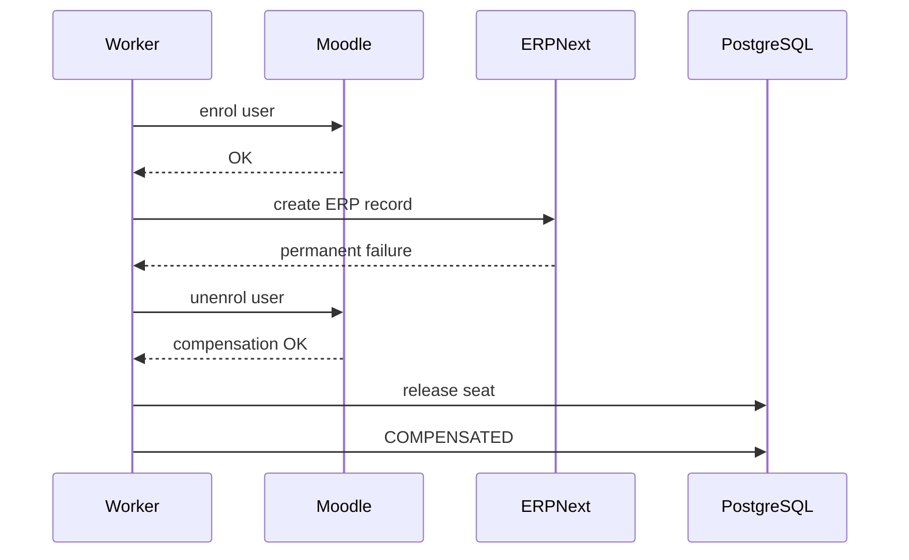

---

# 19. Timeouts

Tous les appels externes doivent avoir un timeout.

**Exemple** :

```python
httpx.get(url, timeout=5.0)
```

Le timeout doit être configurable via variable d’environnement.

---

# 20. Correlation ID

Chaque inscription doit avoir un identifiant de corrélation.

**Exemple** :

```http
X-Correlation-ID: corr-123
```

**Il doit apparaître dans** :

- logs **API** ;
- logs **workers** ;
- messages **RabbitMQ** ;
- historique local ;
- appels externes quand cela est possible.

**Structure d’événement recommandée** :

```json
{
  "eventId": "2b23c...",
  "eventType": "registration.accepted",
  "schemaVersion": 1,
  "correlationId": "corr-123",
  "occurredAt": "2026-10-01T15:00:00Z",
  "payload": {
    "registrationId": "REG-001",
    "sessionId": "SESSION-PYTHON-01"
  }
}
```

---

# 21. Versionnement

**Tous les événements contiennent** :

```json
"schemaVersion": 1
```

**Le README** doit expliquer comment vous feriez évoluer le schéma vers **une v2** sans casser les consumers.

---

# 22. OpenAPI et codes HTTP

**L’API** doit fournir une documentation **Swagger/OpenAPI** (`/docs` avec **FastAPI** ou équivalent).

**Vous devez utiliser et justifier** :

```text
200 OK
201 Created
202 Accepted
400 Bad Request
404 Not Found
409 Conflict
422 Unprocessable Entity
500 Internal Server Error
503 Service Unavailable
```

---

# 23. Sécurité

**Minimum obligatoire** :

- secrets via `.env`, secrets **Docker** ou mécanisme équivalent ;
- aucun token **ERPNext** dans **Git** ;
- aucun token **Moodle** dans **Git** ;
- validation **Pydantic** ou équivalente ;
- `.env.example` sans secrets ;
- `.gitignore` correct.

**Interdit** :

```python
token = "abc123"
```

dans le dépôt.

## Bonus - Keycloak

Vous pouvez sécuriser **l’API** avec **OAuth2/OIDC**.

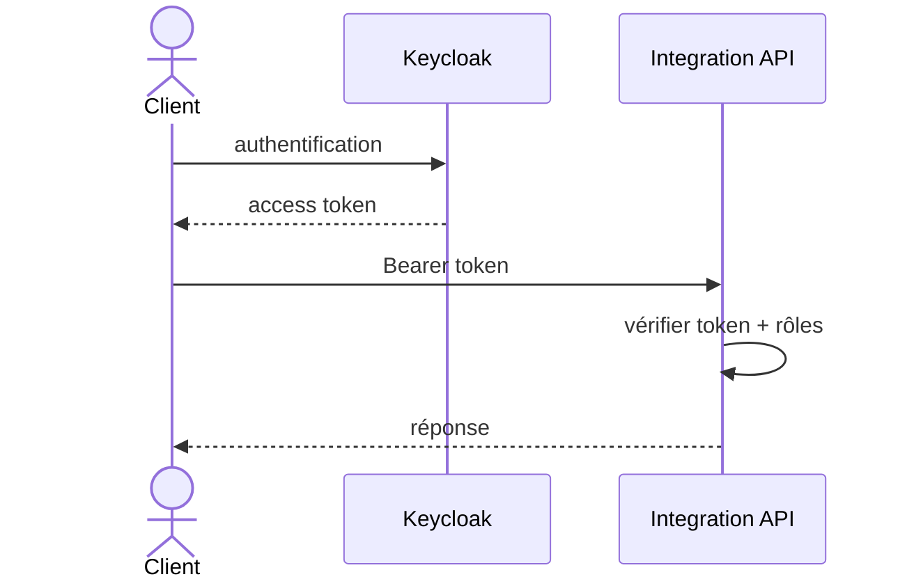

---

# 24. Docker Compose

Le projet doit démarrer de manière reproductible.

**Objectif** :

```bash
docker compose up -d
```

**Services attendus ou stacks intégrées** :

```text
integration-api
registration-worker
outbox-dispatcher
notification-worker
postgres
rabbitmq
moodle
erpnext
mailpit
```

**ERPNext** et **Moodle** peuvent utiliser leurs stacks Docker documentées séparément à condition que le README fournisse une procédure claire et reproductible.

---

# 25. Health checks

**Minimum** :

```http
GET /health
```

```json
{
  "status": "UP"
}
```

**Bonus** :

```http
GET /ready
```

qui vérifie **PostgreSQL** et **RabbitMQ**.

---

# 26. Observabilité

**Format de logs recommandé** :

```json
{
  "level": "INFO",
  "service": "registration-worker",
  "correlationId": "corr-123",
  "registrationId": "REG-001",
  "eventId": "evt-999",
  "message": "Moodle enrollment completed"
}
```

---

# 27. Mailpit

Le `notification-worker` doit pouvoir envoyer un email de confirmation à **Mailpit** après :

```text
registration.confirmed
```

Ainsi, aucune vraie adresse **SMTP** n’est nécessaire.

---

# 28. Flux final

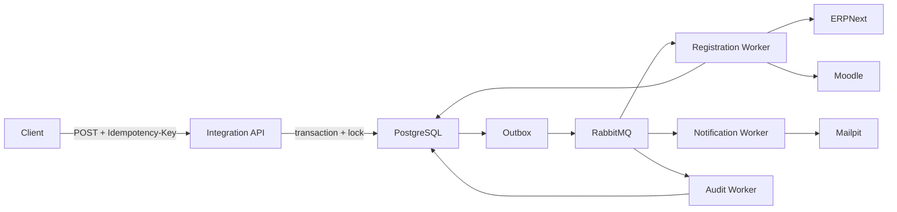

---

# 29. Cas de test obligatoires

## Test 1 - Happy path

```text
1 demande
-> place disponible
-> utilisateur Moodle
-> inscription Moodle
-> client ERPNext
-> trace ERP
-> CONFIRMED
-> email
```

## Test 2 - Idempotency-Key répétée

Même clé + même payload deux fois.

**Attendu** :

```text
même registrationId
une seule inscription
aucun doublon Moodle
aucun doublon ERP
```

## Test 3 - Mauvaise réutilisation de clé

Même clé + payload différent.

**Attendu** :

```http
409 Conflict
```

## Test 4 - Concurrence

```text
capacity = 1
20 clients simultanés
```

**Attendu** :

```text
1 accepté
19 refusés
jamais capacité négative
```

## Test 5 - Message RabbitMQ dupliqué

Publiez volontairement deux fois le même `eventId`.

**Attendu** :

```text
un seul effet métier
```

## Test 6 - Moodle indisponible

Arrêtez **Moodle**.

**Attendu** :

```text
retry
pas de perte de message
état visible
```

## Test 7 - ERPNext indisponible

Même principe.

Le système doit distinguer erreur temporaire et erreur permanente.

## Test 8 - DLQ

Forcez un événement non traitable.

Attendu :

```text
retries épuisés
-> DLQ
```

## Test 9 - Crash worker

Crash après un effet externe.

Relancez.

Attendu :

```text
pas de doublon
```

## Test 10 - Outbox

Simulez :

```text
commit DB
puis
dispatcher arrêté
```

Attendu :

```text
l'événement reste dans outbox
```

Redémarrez le dispatcher : l’événement doit être publié ensuite.

## Test 11 - Compensation

Provoquez :

```text
Moodle OK
ERP erreur permanente
```

Attendu :

```text
compensation
status COMPENSATED
place libérée
```

## Test 12 - Status API

Pendant le traitement :

```http
GET /registrations/{id}
```

doit montrer les transitions d’état.

---

# 30. Scripts de démonstration demandés

Le dépôt doit contenir par exemple :

```text
scripts/
  demo-happy-path.sh
  test-idempotency.py
  test-concurrency.py
  test-duplicate-message.py
  test-failure-moodle.sh
  test-failure-erp.sh
```

---

# 31. Contraintes interdites

Le projet est incomplet si vous :

- écrivez directement dans la DB Moodle ;
- écrivez directement dans la DB ERPNext ;
- supprimez l’idempotence ;
- évitez le test concurrence ;
- utilisez seulement des mocks pour Moodle et ERPNext ;
- faites seulement des appels manuels Postman sans flux automatisé ;
- ACKez RabbitMQ avant le traitement ;
- stockez des secrets dans Git ;
- remplacez RabbitMQ par une liste Python en mémoire.

---

# 32. Organisation recommandée du dépôt

```text
final-si-project/
├── docker-compose.yml
├── .env.example
├── README.md
├── docs/
│   ├── architecture.md
│   ├── api.md
│   └── mermaid.md
├── integration-api/
├── workers/
│   ├── registration/
│   ├── notifications/
│   └── audit/
├── shared/
├── migrations/
├── scripts/
├── tests/
└── infra/
```

---

# 33. Questions de soutenance

Le groupe doit savoir répondre à ces questions :

1. Pourquoi ne pas appeler Moodle directement depuis le frontend ?
2. Pourquoi utiliser RabbitMQ ?
3. Pourquoi `202` est-il adapté au POST d’inscription ?
4. Comment fonctionne votre `Idempotency-Key` ?
5. Que se passe-t-il si la même clé est réutilisée avec un autre body ?
6. Pourquoi une contrainte `UNIQUE` est-elle utile ?
7. Comment empêchez-vous deux réservations de prendre la dernière place ?
8. Que fait `SELECT ... FOR UPDATE` ?
9. Pourquoi un consumer RabbitMQ doit-il être idempotent ?
10. Que se passe-t-il si un worker plante avant ACK ?
11. Et s’il plante après Moodle mais avant ACK ?
12. Pourquoi l’Outbox est-elle nécessaire ?
13. Que se passe-t-il si PostgreSQL commit mais RabbitMQ est indisponible ?
14. Que contient votre DLQ ?
15. Quelles erreurs sont retryables ?
16. Pourquoi ne pas retry un `400` indéfiniment ?
17. Comment corrélez-vous les logs ?
18. Comment gérez-vous les IDs Moodle et ERPNext ?
19. Pourquoi ne pas accéder directement aux DB des logiciels ?
20. Quelle compensation avez-vous implémentée ?
21. Que signifie « at-least-once » ?
22. Pourquoi « exactly once » est difficile dans un SI distribué ?
23. Quelle différence entre idempotence HTTP et idempotence du consumer ?
24. Où se situe votre transaction locale ?
25. Quelles opérations ne peuvent pas appartenir à la même transaction ACID ?

---

# 34. Barème proposé - /20

| Partie | Points |
|---|---:|
| Architecture Docker reproductible | 2 |
| API REST + validation + OpenAPI | 3 |
| Intégration réelle Moodle + ERPNext | 4 |
| Idempotence HTTP et consumers | 2 |
| Gestion correcte de la concurrence | 2 |
| RabbitMQ + Outbox + retry + DLQ | 3 |
| Tests de panne / crash / compensation | 2 |
| Sécurité, logs, README et qualité générale | 2 |
| **Total** | **20** |

---

# 35. Bonus possibles - jusqu’à +2

## Bonus A - Keycloak

OAuth2 / OpenID Connect.

## Bonus B - SuiteCRM

Ajouter un CRM séparé :

```text
SuiteCRM
-> Lead / Contact

ERPNext
-> Customer / Invoice

Moodle
-> Learner / Course
```

## Bonus C - Debezium CDC

Remplacer le polling Outbox par :

```text
PostgreSQL WAL
+
Debezium
```

et expliquer CDC.

## Bonus D - Circuit Breaker

Ajouter un circuit breaker autour des appels Moodle / ERPNext.

## Bonus E - Prometheus + Grafana

Exposer par exemple :

```text
registration_total
registration_failed_total
external_api_latency
rabbitmq_retry_total
idempotency_hit_total
```

---

# 36. Variante très avancée

Pour une promotion très à l’aise :

```text
Moodle
+
SuiteCRM
+
ERPNext
+
RabbitMQ
+
Keycloak
```

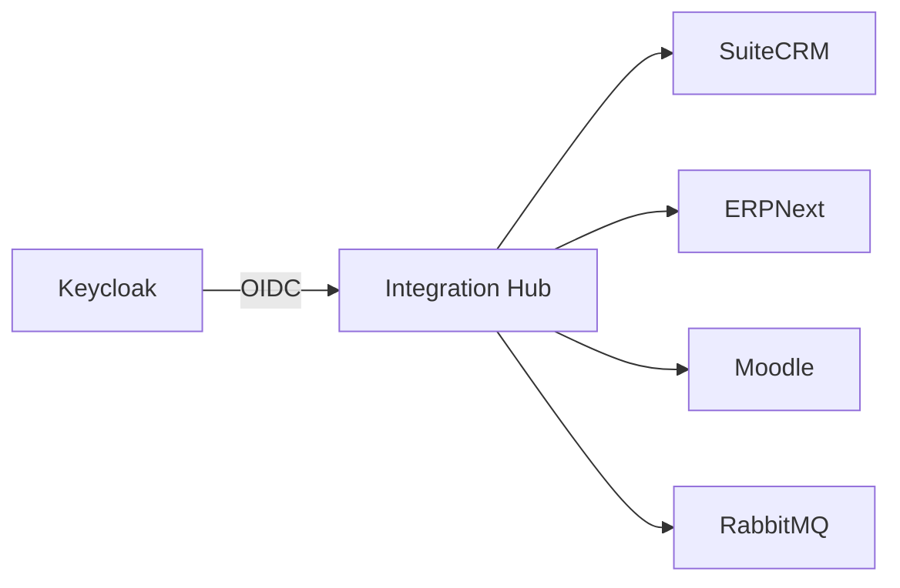

Cette variante demande plus de RAM et plus de temps de configuration.

---

# 37. Version recommandée pour le cours

La version la plus équilibrée est :

```text
Moodle
+
ERPNext
+
RabbitMQ
+
PostgreSQL
+
FastAPI
+
Mailpit
```

ERPNext couvre déjà une partie **CRM + ERP**, ce qui évite d’imposer trois gros logiciels métier tout en conservant un vrai SI hétérogène.

---

# 38. Critères de réussite de la démo finale

Le groupe doit pouvoir montrer en direct :

```text
1. stack démarrée
2. POST inscription
3. 202
4. statut asynchrone
5. utilisateur Moodle
6. inscription Moodle
7. client / document ERPNext
8. notification Mailpit
9. même Idempotency-Key sans doublon
10. 20 requêtes concurrentes sans surbooking
11. message dupliqué sans double effet
12. panne Moodle avec retry
13. message en DLQ
14. redémarrage worker
15. compensation
```

---

# 39. Références techniques

## ERPNext / Frappe

REST API :

`https://docs.frappe.io/framework/user/en/guides/integration/rest_api`

Authentification et CRUD :

`https://docs.frappe.io/framework/user/en/api/rest`

## Moodle

External Services :

`https://moodledev.io/docs/5.0/apis/subsystems/external`

Les fonctions disponibles dépendent de la configuration du site Moodle.

## RabbitMQ

`https://www.rabbitmq.com/tutorials`

## Keycloak - bonus

`https://www.keycloak.org/securing-apps/oidc-layers`

---

# 40. Résumé

Ce projet ne consiste pas à développer un faux ERP ou un faux LMS.

Les étudiants doivent intégrer **de vrais composants open source** et résoudre de vrais problèmes de systèmes distribués :

```text
APIs
authentification
mapping d’identifiants
latence
timeout
idempotence
concurrence
transactions locales
messaging
at-least-once
duplicates
outbox
retry
DLQ
crash
compensation
observabilité
```

Le point essentiel est le suivant :

> une intégration professionnelle ne consiste pas seulement à savoir faire un `GET` et un `POST`, mais à garantir un comportement cohérent lorsque plusieurs systèmes réels, indépendants et faillibles doivent coopérer.
