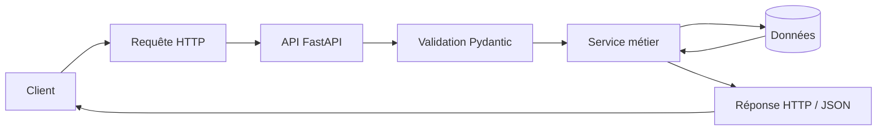
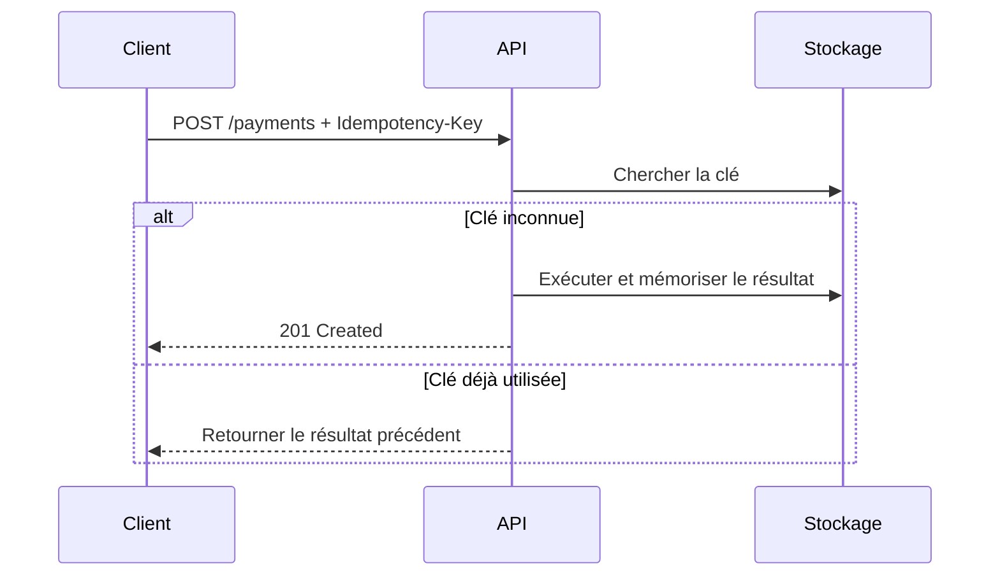
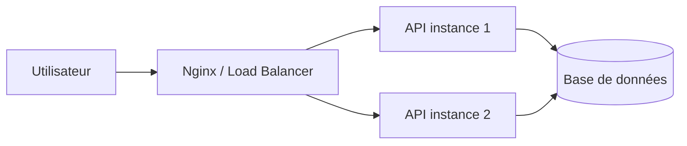
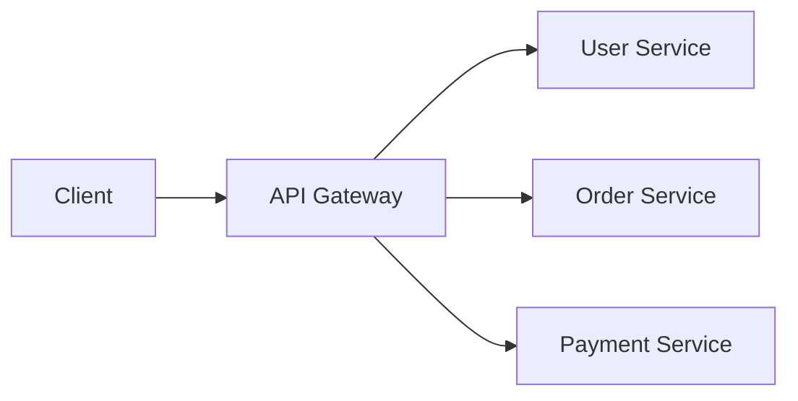
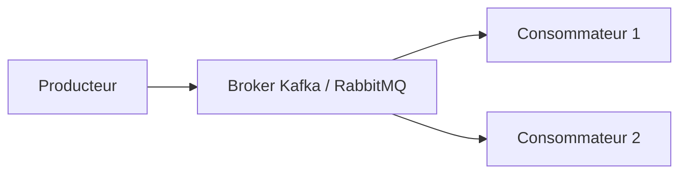

# TP 1 - APIs REST et échanges de données

## HTTP, JSON, CRUD, validation, erreurs, tests et clients

**Niveau :** avancé  
**Durée conseillée :** 4 h à 6 h  
**Technologies :** Python 3.11+, FastAPI, Uvicorn, HTTPX, Pytest, JSON, HTTP/1.1  
**Systèmes :** Linux, macOS, Windows PowerShell et Windows CMD

---

## 1. Objectifs du TP

**À la fin de ce TP, vous serez capable de** :

- comprendre précisément le fonctionnement d'un échange **HTTP client-serveur** ;
- distinguer les méthodes **GET, POST, PUT, PATCH et DELETE** ;
- utiliser correctement les principaux **codes de statut HTTP** ;
- construire une **API REST versionnée** ;
- envoyer et recevoir des données au format **JSON** ;
- valider automatiquement les données entrantes ;
- gérer les erreurs fonctionnelles et techniques ;
- utiliser les **headers HTTP** ;
- tester une **API** avec `curl`, PowerShell et Python ;
- écrire des tests automatisés avec **Pytest** ;
- comprendre l'**idempotence**, la pagination, le filtrage et les timeouts ;
- utiliser une documentation **OpenAPI / Swagger** ;
- appliquer plusieurs bonnes pratiques utilisées dans des **API professionnelles**.

---

## 2. Architecture générale



### Exemple d'échange

```text
Client
  |
  | POST /api/v1/users
  | Content-Type: application/json
  |
  | {
  |   "name": "Lydia",
  |   "email": "lydia@example.com",
  |   "age": 25
  | }
  v
Serveur
  |
  | Validation
  | Création de la ressource
  v
HTTP/1.1 201 Created

{
  "id": "...",
  "name": "Lydia",
  "email": "lydia@example.com",
  "age": 25
}
```

---

# Partie A - Comprendre HTTP avant de coder

## 3. Anatomie d'une requête HTTP

Une requête HTTP est composée principalement de :

1. une **méthode** ;
2. une **URL** ;
3. des **headers** ;
4. éventuellement un **body**.

Exemple :

```http
POST /api/v1/users HTTP/1.1
Host: localhost:8000
Content-Type: application/json
Accept: application/json

{
  "name": "Lydia",
  "email": "lydia@example.com",
  "age": 25
}
```

### Méthodes HTTP principales

| Méthode | Utilisation | Body habituel | Idempotente |
|---|---|---:|---:|
| `GET` | Lire une ressource | Non | Oui |
| `POST` | Créer une ressource | Oui | Non |
| `PUT` | Remplacer une ressource | Oui | Oui |
| `PATCH` | Modifier partiellement | Oui | En principe oui si conçu ainsi |
| `DELETE` | Supprimer une ressource | Rarement | Oui |

> **Important :** une méthode idempotente peut être exécutée plusieurs fois avec le même effet final côté serveur.

---

## 4. Anatomie d'une réponse HTTP

Exemple :

```http
HTTP/1.1 201 Created
Content-Type: application/json
Location: /api/v1/users/8d69d64d

{
  "id": "8d69d64d",
  "name": "Lydia",
  "email": "lydia@example.com",
  "age": 25
}
```

### Codes HTTP à connaître

| Code | Signification | Exemple |
|---:|---|---|
| `200` | OK | Lecture réussie |
| `201` | Created | Ressource créée |
| `204` | No Content | Suppression réussie |
| `400` | Bad Request | Requête incorrecte |
| `401` | Unauthorized | Authentification absente ou invalide |
| `403` | Forbidden | Accès refusé |
| `404` | Not Found | Ressource inexistante |
| `409` | Conflict | Doublon ou conflit métier |
| `415` | Unsupported Media Type | Mauvais `Content-Type` |
| `422` | Unprocessable Content | Données invalides |
| `429` | Too Many Requests | Limite de requêtes dépassée |
| `500` | Internal Server Error | Erreur serveur |
| `503` | Service Unavailable | Service temporairement indisponible |

---

## 5. REST : règles essentielles

Une API REST professionnelle devrait notamment :

- utiliser des **noms de ressources** et non des verbes dans les URL ;
- utiliser correctement les méthodes HTTP ;
- rester aussi **stateless** que possible ;
- utiliser des codes de statut cohérents ;
- échanger des représentations structurées, souvent en **JSON** ;
- gérer la version de l'API.

### Bonnes URL

```text
GET    /api/v1/users
GET    /api/v1/users/{id}
POST   /api/v1/users
PATCH  /api/v1/users/{id}
DELETE /api/v1/users/{id}
```

### URL déconseillée

```text
GET /getUsers
POST /createUser
POST /deleteUser
```

---

# Partie B - Préparer l'environnement

## 6. Vérifier Python

### Linux / macOS

```bash
python3 --version
```

### Windows PowerShell ou CMD

```powershell
py --version
```

Une version **Python 3.11 ou supérieure** est recommandée.

---

## 7. Créer le projet

### Linux / macOS

```bash
mkdir tp1-api
cd tp1-api

python3 -m venv .venv
source .venv/bin/activate
```

### Windows PowerShell

```powershell
mkdir tp1-api
cd tp1-api

py -m venv .venv
.\.venv\Scripts\Activate.ps1
```

Si PowerShell refuse l'activation :

```powershell
Set-ExecutionPolicy -Scope CurrentUser RemoteSigned
```

Puis relancer :

```powershell
.\.venv\Scripts\Activate.ps1
```

### Windows CMD

```bat
mkdir tp1-api
cd tp1-api

py -m venv .venv
.venv\Scripts\activate.bat
```

---

## 8. Installer les dépendances

```bash
pip install fastapi "uvicorn[standard]" httpx pytest email-validator
```

Créer le fichier `requirements.txt` :

```txt
fastapi
uvicorn[standard]
httpx
pytest
email-validator
```

Installation depuis le fichier :

```bash
pip install -r requirements.txt
```

---

## 9. Arborescence cible

```text
tp1-api/
|
|-- app/
|   |-- __init__.py
|   |-- main.py
|
|-- tests/
|   |-- __init__.py
|   |-- test_api.py
|
|-- client.py
|-- requirements.txt
|-- README.md
```

### Linux / macOS

```bash
mkdir -p app tests
touch app/__init__.py tests/__init__.py
touch app/main.py tests/test_api.py client.py
```

### Windows PowerShell

```powershell
mkdir app
mkdir tests

New-Item app\__init__.py -ItemType File
New-Item tests\__init__.py -ItemType File
New-Item app\main.py -ItemType File
New-Item tests\test_api.py -ItemType File
New-Item client.py -ItemType File
```

---

# Partie C - Construire l'API

## 10. Premier endpoint

Dans `app/main.py` :

```python
from fastapi import FastAPI

app = FastAPI(
    title="TP1 Users API",
    version="1.0.0",
    description="API pédagogique pour étudier HTTP, REST et JSON."
)


@app.get("/health")
def health_check():
    """
    Endpoint simple utilisé pour vérifier que l'API fonctionne.
    """
    return {
        "status": "ok"
    }
```

---

## 11. Démarrer le serveur

### Tous les systèmes

```bash
uvicorn app.main:app --reload
```

Le serveur écoute normalement sur :

```text
http://127.0.0.1:8000
```

### Vérification

Navigateur :

```text
http://127.0.0.1:8000/health
```

Réponse :

```json
{
  "status": "ok"
}
```

Documentation Swagger :

```text
http://127.0.0.1:8000/docs
```

Documentation ReDoc :

```text
http://127.0.0.1:8000/redoc
```

Schéma OpenAPI :

```text
http://127.0.0.1:8000/openapi.json
```

---

# Partie D - API CRUD complète

## 12. Modèles de données

Remplacez maintenant `app/main.py` par la version complète suivante.

```python
from __future__ import annotations

from typing import Annotated
from uuid import UUID, uuid4

from fastapi import FastAPI, HTTPException, Query, Response, status
from pydantic import BaseModel, ConfigDict, EmailStr, Field


# -------------------------------------------------------------------
# Configuration de l'application
# -------------------------------------------------------------------

app = FastAPI(
    title="TP1 Users API",
    version="1.0.0",
    description=(
        "API REST pédagogique permettant de manipuler des utilisateurs "
        "et d'étudier les échanges HTTP/JSON."
    ),
)


# -------------------------------------------------------------------
# Modèles Pydantic
# -------------------------------------------------------------------

class UserCreate(BaseModel):
    """
    Données nécessaires à la création d'un utilisateur.

    L'identifiant n'est pas fourni par le client :
    il sera généré par le serveur.
    """

    name: str = Field(
        min_length=2,
        max_length=80,
        examples=["Lydia"]
    )

    email: EmailStr = Field(
        examples=["lydia@example.com"]
    )

    age: int = Field(
        ge=18,
        le=120,
        examples=[25]
    )


class UserUpdate(BaseModel):
    """
    Modèle utilisé pour PATCH.

    Tous les champs sont optionnels car PATCH représente
    une mise à jour partielle.
    """

    name: str | None = Field(
        default=None,
        min_length=2,
        max_length=80
    )

    email: EmailStr | None = None

    age: int | None = Field(
        default=None,
        ge=18,
        le=120
    )


class UserOut(BaseModel):
    """
    Modèle retourné au client.
    """

    model_config = ConfigDict(from_attributes=True)

    id: UUID
    name: str
    email: EmailStr
    age: int


# -------------------------------------------------------------------
# Stockage en mémoire
# -------------------------------------------------------------------

users: dict[UUID, UserOut] = {}


# -------------------------------------------------------------------
# Fonctions utilitaires
# -------------------------------------------------------------------

def get_user_or_404(user_id: UUID) -> UserOut:
    """
    Retourne l'utilisateur demandé.

    Lève une erreur HTTP 404 si l'identifiant n'existe pas.
    """

    user = users.get(user_id)

    if user is None:
        raise HTTPException(
            status_code=status.HTTP_404_NOT_FOUND,
            detail="Utilisateur introuvable"
        )

    return user


def email_already_exists(email: str, ignored_user_id: UUID | None = None) -> bool:
    """
    Vérifie qu'un email n'est pas déjà utilisé.

    ignored_user_id permet d'ignorer un utilisateur lors d'une modification.
    """

    normalized_email = email.lower()

    for user_id, user in users.items():

        if ignored_user_id is not None and user_id == ignored_user_id:
            continue

        if str(user.email).lower() == normalized_email:
            return True

    return False


# -------------------------------------------------------------------
# Endpoint de santé
# -------------------------------------------------------------------

@app.get(
    "/health",
    tags=["system"]
)
def health_check():
    return {
        "status": "ok"
    }


# -------------------------------------------------------------------
# CREATE
# -------------------------------------------------------------------

@app.post(
    "/api/v1/users",
    response_model=UserOut,
    status_code=status.HTTP_201_CREATED,
    tags=["users"]
)
def create_user(payload: UserCreate, response: Response):
    """
    Crée un nouvel utilisateur.
    """

    if email_already_exists(str(payload.email)):
        raise HTTPException(
            status_code=status.HTTP_409_CONFLICT,
            detail="Cet email existe déjà"
        )

    user_id = uuid4()

    user = UserOut(
        id=user_id,
        name=payload.name,
        email=payload.email,
        age=payload.age
    )

    users[user_id] = user

    # Le header Location permet d'indiquer l'URL
    # de la nouvelle ressource.
    response.headers["Location"] = f"/api/v1/users/{user_id}"

    return user


# -------------------------------------------------------------------
# READ - COLLECTION
# -------------------------------------------------------------------

@app.get(
    "/api/v1/users",
    response_model=list[UserOut],
    tags=["users"]
)
def list_users(
    q: Annotated[
        str | None,
        Query(
            default=None,
            description="Recherche sur le nom ou l'email"
        )
    ] = None,

    offset: Annotated[
        int,
        Query(
            ge=0,
            description="Nombre d'éléments à ignorer"
        )
    ] = 0,

    limit: Annotated[
        int,
        Query(
            ge=1,
            le=100,
            description="Nombre maximum d'éléments retournés"
        )
    ] = 20,
):
    """
    Liste les utilisateurs.

    Supporte :
    - la recherche ;
    - la pagination par offset/limit.
    """

    result = list(users.values())

    if q:
        search = q.lower()

        result = [
            user
            for user in result
            if search in user.name.lower()
            or search in str(user.email).lower()
        ]

    return result[offset: offset + limit]


# -------------------------------------------------------------------
# READ - ITEM
# -------------------------------------------------------------------

@app.get(
    "/api/v1/users/{user_id}",
    response_model=UserOut,
    tags=["users"]
)
def get_user(user_id: UUID):
    """
    Retourne un utilisateur précis.
    """

    return get_user_or_404(user_id)


# -------------------------------------------------------------------
# PUT
# -------------------------------------------------------------------

@app.put(
    "/api/v1/users/{user_id}",
    response_model=UserOut,
    tags=["users"]
)
def replace_user(user_id: UUID, payload: UserCreate):
    """
    Remplace entièrement l'utilisateur.

    PUT attend ici l'ensemble des champs.
    """

    get_user_or_404(user_id)

    if email_already_exists(
        str(payload.email),
        ignored_user_id=user_id
    ):
        raise HTTPException(
            status_code=status.HTTP_409_CONFLICT,
            detail="Cet email existe déjà"
        )

    updated_user = UserOut(
        id=user_id,
        name=payload.name,
        email=payload.email,
        age=payload.age
    )

    users[user_id] = updated_user

    return updated_user


# -------------------------------------------------------------------
# PATCH
# -------------------------------------------------------------------

@app.patch(
    "/api/v1/users/{user_id}",
    response_model=UserOut,
    tags=["users"]
)
def update_user(user_id: UUID, payload: UserUpdate):
    """
    Modifie partiellement un utilisateur.
    """

    current_user = get_user_or_404(user_id)

    # exclude_unset=True est essentiel :
    # seuls les champs réellement envoyés sont pris en compte.
    changes = payload.model_dump(exclude_unset=True)

    if "email" in changes and changes["email"] is not None:

        if email_already_exists(
            str(changes["email"]),
            ignored_user_id=user_id
        ):
            raise HTTPException(
                status_code=status.HTTP_409_CONFLICT,
                detail="Cet email existe déjà"
            )

    merged_data = current_user.model_dump()
    merged_data.update(changes)

    updated_user = UserOut(**merged_data)

    users[user_id] = updated_user

    return updated_user


# -------------------------------------------------------------------
# DELETE
# -------------------------------------------------------------------

@app.delete(
    "/api/v1/users/{user_id}",
    status_code=status.HTTP_204_NO_CONTENT,
    tags=["users"]
)
def delete_user(user_id: UUID):
    """
    Supprime un utilisateur.

    Une réponse 204 ne contient pas de body.
    """

    get_user_or_404(user_id)

    del users[user_id]

    return Response(status_code=status.HTTP_204_NO_CONTENT)
```

---

# Partie E - Tester les échanges HTTP

## 13. Tester avec curl sous Linux / macOS

### Vérifier l'API

```bash
curl -i http://127.0.0.1:8000/health
```

L'option `-i` affiche également les headers HTTP.

---

### Créer un utilisateur

```bash
curl -i \
  -X POST \
  http://127.0.0.1:8000/api/v1/users \
  -H "Content-Type: application/json" \
  -H "Accept: application/json" \
  -d '{
    "name": "Lydia",
    "email": "lydia@example.com",
    "age": 25
  }'
```

---

### Lister les utilisateurs

```bash
curl -i \
  "http://127.0.0.1:8000/api/v1/users"
```

---

### Pagination

```bash
curl -i \
  "http://127.0.0.1:8000/api/v1/users?offset=0&limit=10"
```

---

### Recherche

```bash
curl -i \
  "http://127.0.0.1:8000/api/v1/users?q=lydia"
```

---

### Récupérer un utilisateur

Remplacez `<UUID>` par l'identifiant reçu lors du `POST`.

```bash
curl -i \
  "http://127.0.0.1:8000/api/v1/users/<UUID>"
```

---

### Modifier partiellement un utilisateur

```bash
curl -i \
  -X PATCH \
  "http://127.0.0.1:8000/api/v1/users/<UUID>" \
  -H "Content-Type: application/json" \
  -d '{
    "age": 26
  }'
```

---

### Remplacer complètement un utilisateur

```bash
curl -i \
  -X PUT \
  "http://127.0.0.1:8000/api/v1/users/<UUID>" \
  -H "Content-Type: application/json" \
  -d '{
    "name": "Lydia Amrouche",
    "email": "lydia@example.com",
    "age": 26
  }'
```

---

### Supprimer un utilisateur

```bash
curl -i \
  -X DELETE \
  "http://127.0.0.1:8000/api/v1/users/<UUID>"
```

Réponse attendue :

```text
HTTP/1.1 204 No Content
```

---

# Partie F - Tester sous Windows

## 14. PowerShell avec curl.exe

Sous PowerShell, il est préférable d'utiliser explicitement `curl.exe`.

### GET

```powershell
curl.exe -i http://127.0.0.1:8000/health
```

### POST

```powershell
curl.exe -i `
  -X POST `
  "http://127.0.0.1:8000/api/v1/users" `
  -H "Content-Type: application/json" `
  -H "Accept: application/json" `
  -d "{\"name\":\"Lydia\",\"email\":\"lydia@example.com\",\"age\":25}"
```

### PATCH

```powershell
curl.exe -i `
  -X PATCH `
  "http://127.0.0.1:8000/api/v1/users/<UUID>" `
  -H "Content-Type: application/json" `
  -d "{\"age\":26}"
```

### DELETE

```powershell
curl.exe -i `
  -X DELETE `
  "http://127.0.0.1:8000/api/v1/users/<UUID>"
```

---

## 15. PowerShell avec Invoke-RestMethod

### POST

```powershell
$body = @{
    name  = "Lydia"
    email = "lydia@example.com"
    age   = 25
} | ConvertTo-Json

Invoke-RestMethod `
    -Method Post `
    -Uri "http://127.0.0.1:8000/api/v1/users" `
    -ContentType "application/json" `
    -Body $body
```

### GET

```powershell
Invoke-RestMethod `
    -Method Get `
    -Uri "http://127.0.0.1:8000/api/v1/users"
```

### PATCH

```powershell
$body = @{
    age = 26
} | ConvertTo-Json

Invoke-RestMethod `
    -Method Patch `
    -Uri "http://127.0.0.1:8000/api/v1/users/<UUID>" `
    -ContentType "application/json" `
    -Body $body
```

---

# Partie G - Observer les erreurs

## 16. Erreur de validation

Test :

```bash
curl -i \
  -X POST \
  http://127.0.0.1:8000/api/v1/users \
  -H "Content-Type: application/json" \
  -d '{
    "name": "A",
    "email": "email-invalide",
    "age": 12
  }'
```

FastAPI retourne une erreur `422`.

### Pourquoi ?

Trois règles sont violées :

- `name` contient moins de 2 caractères ;
- `email` n'est pas valide ;
- `age` est inférieur à 18.

---

## 17. Erreur 404

```bash
curl -i \
  "http://127.0.0.1:8000/api/v1/users/00000000-0000-0000-0000-000000000000"
```

Réponse attendue :

```json
{
  "detail": "Utilisateur introuvable"
}
```

---

## 18. Erreur 409

Créez deux utilisateurs avec le même email.

La deuxième requête doit retourner :

```text
HTTP/1.1 409 Conflict
```

Avec :

```json
{
  "detail": "Cet email existe déjà"
}
```

---

# Partie H - Client Python

## 19. Écrire un client HTTP

Créer `client.py` :

```python
import httpx


BASE_URL = "http://127.0.0.1:8000"


def main():
    """
    Exemple de client consommant notre API.

    httpx joue ici le rôle du client HTTP.
    """

    # Timeout explicite :
    # un client ne doit pas attendre indéfiniment.
    timeout = httpx.Timeout(5.0)

    with httpx.Client(
        base_url=BASE_URL,
        timeout=timeout,
        headers={
            "Accept": "application/json"
        }
    ) as client:

        # -----------------------------------------------------------
        # 1. Vérifier le serveur
        # -----------------------------------------------------------

        response = client.get("/health")

        response.raise_for_status()

        print("Health:")
        print(response.json())

        # -----------------------------------------------------------
        # 2. Créer un utilisateur
        # -----------------------------------------------------------

        payload = {
            "name": "Alice",
            "email": "alice@example.com",
            "age": 30
        }

        response = client.post(
            "/api/v1/users",
            json=payload
        )

        response.raise_for_status()

        created_user = response.json()

        print("\nUtilisateur créé:")
        print(created_user)

        user_id = created_user["id"]

        # -----------------------------------------------------------
        # 3. Lire l'utilisateur
        # -----------------------------------------------------------

        response = client.get(
            f"/api/v1/users/{user_id}"
        )

        response.raise_for_status()

        print("\nUtilisateur lu:")
        print(response.json())

        # -----------------------------------------------------------
        # 4. Modifier l'utilisateur
        # -----------------------------------------------------------

        response = client.patch(
            f"/api/v1/users/{user_id}",
            json={
                "age": 31
            }
        )

        response.raise_for_status()

        print("\nUtilisateur modifié:")
        print(response.json())

        # -----------------------------------------------------------
        # 5. Supprimer l'utilisateur
        # -----------------------------------------------------------

        response = client.delete(
            f"/api/v1/users/{user_id}"
        )

        if response.status_code != 204:
            raise RuntimeError(
                f"Suppression impossible : {response.status_code}"
            )

        print("\nUtilisateur supprimé.")


if __name__ == "__main__":
    main()
```

Exécuter :

### Linux / macOS

```bash
python3 client.py
```

### Windows

```powershell
py client.py
```

---

# Partie I - Tests automatisés

## 20. Créer les tests

Dans `tests/test_api.py` :

```python
from fastapi.testclient import TestClient

from app.main import app, users


client = TestClient(app)


def setup_function():
    """
    Cette fonction est exécutée avant chaque test.

    Elle permet de vider la pseudo-base en mémoire
    afin de rendre les tests indépendants.
    """

    users.clear()


def test_health():
    response = client.get("/health")

    assert response.status_code == 200

    assert response.json() == {
        "status": "ok"
    }


def test_create_user():
    response = client.post(
        "/api/v1/users",
        json={
            "name": "Alice",
            "email": "alice@example.com",
            "age": 30
        }
    )

    assert response.status_code == 201

    data = response.json()

    assert data["name"] == "Alice"
    assert data["email"] == "alice@example.com"
    assert data["age"] == 30

    # Vérifie également le header Location.
    assert "location" in response.headers


def test_duplicate_email_returns_409():
    payload = {
        "name": "Alice",
        "email": "alice@example.com",
        "age": 30
    }

    first_response = client.post(
        "/api/v1/users",
        json=payload
    )

    assert first_response.status_code == 201

    second_response = client.post(
        "/api/v1/users",
        json=payload
    )

    assert second_response.status_code == 409


def test_invalid_payload_returns_422():
    response = client.post(
        "/api/v1/users",
        json={
            "name": "A",
            "email": "not-an-email",
            "age": 15
        }
    )

    assert response.status_code == 422


def test_get_unknown_user_returns_404():
    response = client.get(
        "/api/v1/users/00000000-0000-0000-0000-000000000000"
    )

    assert response.status_code == 404


def test_patch_user():
    create_response = client.post(
        "/api/v1/users",
        json={
            "name": "Alice",
            "email": "alice@example.com",
            "age": 30
        }
    )

    user_id = create_response.json()["id"]

    update_response = client.patch(
        f"/api/v1/users/{user_id}",
        json={
            "age": 31
        }
    )

    assert update_response.status_code == 200

    data = update_response.json()

    assert data["age"] == 31
    assert data["name"] == "Alice"


def test_delete_user():
    create_response = client.post(
        "/api/v1/users",
        json={
            "name": "Alice",
            "email": "alice@example.com",
            "age": 30
        }
    )

    user_id = create_response.json()["id"]

    delete_response = client.delete(
        f"/api/v1/users/{user_id}"
    )

    assert delete_response.status_code == 204

    get_response = client.get(
        f"/api/v1/users/{user_id}"
    )

    assert get_response.status_code == 404


def test_pagination():
    for index in range(5):

        response = client.post(
            "/api/v1/users",
            json={
                "name": f"User {index}",
                "email": f"user{index}@example.com",
                "age": 20 + index
            }
        )

        assert response.status_code == 201

    response = client.get(
        "/api/v1/users?offset=1&limit=2"
    )

    assert response.status_code == 200

    data = response.json()

    assert len(data) == 2
```

---

## 21. Lancer les tests

```bash
pytest -v
```

Résultat attendu :

```text
test_health PASSED
test_create_user PASSED
test_duplicate_email_returns_409 PASSED
test_invalid_payload_returns_422 PASSED
test_get_unknown_user_returns_404 PASSED
test_patch_user PASSED
test_delete_user PASSED
test_pagination PASSED
```

---

# Partie J - Comprendre ce qui circule réellement

## 22. Headers importants

### Content-Type

Le header :

```http
Content-Type: application/json
```

signifie :

> le contenu envoyé dans le body est du JSON.

### Accept

```http
Accept: application/json
```

signifie :

> le client souhaite recevoir du JSON.

### Authorization

Utilisé pour transmettre une authentification :

```http
Authorization: Bearer eyJ...
```

### User-Agent

Identifie généralement le client :

```http
User-Agent: python-httpx/0.x
```

### Location

Souvent utilisé après un `POST` :

```http
Location: /api/v1/users/...
```

---

# Partie K - Ajouter un identifiant de requête

## 23. Middleware Request ID

Dans `app/main.py`, ajouter les imports :

```python
from uuid import uuid4

from fastapi import Request
```

Puis :

```python
@app.middleware("http")
async def add_request_id(request: Request, call_next):
    """
    Ajoute un identifiant unique à chaque échange HTTP.

    Très utile pour :
    - les logs ;
    - le debugging ;
    - le tracing distribué ;
    - la corrélation entre plusieurs services.
    """

    request_id = request.headers.get(
        "X-Request-ID",
        str(uuid4())
    )

    response = await call_next(request)

    response.headers["X-Request-ID"] = request_id

    return response
```

Tester :

```bash
curl -i http://127.0.0.1:8000/health
```

Vous devriez voir :

```text
X-Request-ID: ...
```

---

# Partie L - Authentification simple par API Key

## 24. Ajouter une clé d'API

> Cette solution sert à comprendre le mécanisme. Pour une vraie application publique, on utilisera souvent OAuth2, OpenID Connect, JWT ou un fournisseur d'identité.

Ajouter :

```python
import os

from fastapi import Header
```

Puis :

```python
API_KEY = os.getenv(
    "TP1_API_KEY",
    "dev-secret-key"
)


def require_api_key(
    x_api_key: str | None = Header(default=None)
):
    """
    Vérifie le header X-API-Key.
    """

    if x_api_key != API_KEY:
        raise HTTPException(
            status_code=status.HTTP_401_UNAUTHORIZED,
            detail="Clé API invalide"
        )
```

Pour protéger un endpoint :

```python
from fastapi import Depends
```

Exemple :

```python
@app.get(
    "/api/v1/private",
    dependencies=[Depends(require_api_key)]
)
def private_endpoint():
    return {
        "message": "Accès autorisé"
    }
```

### Linux / macOS

```bash
export TP1_API_KEY="my-super-secret-key"
uvicorn app.main:app --reload
```

### Windows PowerShell

```powershell
$env:TP1_API_KEY="my-super-secret-key"
uvicorn app.main:app --reload
```

### Requête autorisée

```bash
curl -i \
  http://127.0.0.1:8000/api/v1/private \
  -H "X-API-Key: my-super-secret-key"
```

---

# Partie M - Timeout, retry et résilience

## 25. Pourquoi mettre un timeout ?

Sans timeout :

```text
Client -> API distante indisponible -> attente potentiellement très longue
```

Avec timeout :

```text
Client -> API distante
       -> délai maximum atteint
       -> erreur contrôlée
```

Exemple :

```python
import httpx


try:
    response = httpx.get(
        "https://example.org/api",
        timeout=3.0
    )

    response.raise_for_status()

except httpx.TimeoutException:
    print("Le service distant a dépassé le délai autorisé.")

except httpx.HTTPStatusError as exc:
    print(
        "Le serveur a répondu avec une erreur HTTP:",
        exc.response.status_code
    )

except httpx.RequestError as exc:
    print(
        "Erreur réseau:",
        str(exc)
    )
```

---

# Partie N - Idempotence

## 26. Comprendre l'idempotence

Imaginons :

```text
DELETE /api/v1/users/123
```

Premier appel :

```text
204 No Content
```

Deuxième appel :

```text
404 Not Found
```

Même si le code HTTP diffère, l'**état final** reste identique :

```text
l'utilisateur 123 n'existe pas.
```

---

## 27. Idempotency-Key pour les créations sensibles

Dans les systèmes de paiement ou de réservation, il est fréquent d'envoyer :

```http
Idempotency-Key: 84a0a5b2-...
```

Objectif :

- éviter de créer deux paiements ;
- éviter une double commande ;
- sécuriser les retries client.

Pseudo-flux :



---

# Partie O - Pagination professionnelle

## 28. Offset pagination

Notre API utilise :

```text
GET /api/v1/users?offset=20&limit=20
```

Avantage :

- simple à comprendre.

Inconvénient :

- moins efficace sur de très gros volumes ;
- peut donner des résultats instables si beaucoup d'éléments sont insérés simultanément.

---

## 29. Cursor pagination

Une API plus avancée peut utiliser :

```text
GET /api/v1/users?cursor=eyJpZCI6MTAwfQ&limit=20
```

Le serveur retourne ensuite :

```json
{
  "items": [],
  "next_cursor": "eyJpZCI6MTIwfQ"
}
```

Cette approche est souvent mieux adaptée à de gros volumes.

---

# Partie P - CORS

## 30. Pourquoi CORS existe ?

Un frontend exécuté dans un navigateur peut être sur :

```text
http://localhost:3000
```

et appeler l'API :

```text
http://localhost:8000
```

Ces deux origines sont différentes.

Ajouter :

```python
from fastapi.middleware.cors import CORSMiddleware
```

Puis :

```python
app.add_middleware(
    CORSMiddleware,
    allow_origins=[
        "http://localhost:3000"
    ],
    allow_credentials=True,
    allow_methods=[
        "GET",
        "POST",
        "PUT",
        "PATCH",
        "DELETE"
    ],
    allow_headers=[
        "*"
    ],
)
```

> **Important :** en production, évitez `allow_origins=["*"]` si l'application utilise des données sensibles ou des cookies d'authentification.

---

# Partie Q - Exercices

## Exercice 1 - Endpoint statistics

Créer :

```text
GET /api/v1/stats
```

Le résultat attendu :

```json
{
  "users_count": 3
}
```

### Solution

```python
@app.get(
    "/api/v1/stats",
    tags=["statistics"]
)
def get_stats():
    return {
        "users_count": len(users)
    }
```

---

## Exercice 2 - Filtrer par âge minimum

Ajouter à :

```text
GET /api/v1/users
```

le paramètre :

```text
min_age
```

Exemple :

```text
GET /api/v1/users?min_age=25
```

### Solution

Ajouter dans les paramètres :

```python
min_age: Annotated[
    int | None,
    Query(
        default=None,
        ge=18,
        le=120
    )
] = None,
```

Puis :

```python
if min_age is not None:
    result = [
        user
        for user in result
        if user.age >= min_age
    ]
```

---

## Exercice 3 - Endpoint bulk

Créer :

```text
POST /api/v1/users/bulk
```

pour recevoir plusieurs utilisateurs.

### Modèle

```python
class BulkUserCreate(BaseModel):
    users: list[UserCreate]
```

### Solution simplifiée

```python
@app.post(
    "/api/v1/users/bulk",
    response_model=list[UserOut],
    status_code=status.HTTP_201_CREATED
)
def bulk_create_users(payload: BulkUserCreate):

    created_users: list[UserOut] = []

    for item in payload.users:

        if email_already_exists(str(item.email)):
            raise HTTPException(
                status_code=status.HTTP_409_CONFLICT,
                detail=f"Email déjà utilisé : {item.email}"
            )

        user = UserOut(
            id=uuid4(),
            name=item.name,
            email=item.email,
            age=item.age
        )

        users[user.id] = user
        created_users.append(user)

    return created_users
```

### Question importante

Que se passe-t-il si le troisième utilisateur provoque une erreur après que les deux premiers ont déjà été ajoutés ?

Réponse :

> notre stockage en mémoire ne possède aucune transaction.

Avec une base SQL, il serait préférable d'utiliser une **transaction** pour garantir l'atomicité.

---

# Partie R - Analyse d'une API externe

## 31. Consommer une API publique

Exemple avec JSONPlaceholder :

```python
import httpx


URL = "https://jsonplaceholder.typicode.com/posts/1"

response = httpx.get(
    URL,
    timeout=5.0
)

print("Status:", response.status_code)
print("Content-Type:", response.headers.get("content-type"))
print("Body:")
print(response.json())
```

Questions :

1. Quelle méthode HTTP est utilisée ?
2. Quel code HTTP est retourné ?
3. Quel est le `Content-Type` ?
4. Quel type Python retourne `response.json()` ?
5. Que fait `response.raise_for_status()` ?
6. Pourquoi un timeout est-il important ?

---

# Partie S - Debugging

## 32. API inaccessible

Erreur :

```text
Connection refused
```

Vérifications :

```bash
uvicorn app.main:app --reload
```

Puis :

```bash
curl http://127.0.0.1:8000/health
```

---

## 33. Module introuvable

Erreur :

```text
ModuleNotFoundError: No module named 'fastapi'
```

Vérifier que l'environnement virtuel est activé.

### Linux / macOS

```bash
which python
which pip
```

### Windows PowerShell

```powershell
Get-Command python
Get-Command pip
```

Puis :

```bash
pip install -r requirements.txt
```

---

## 34. Port déjà utilisé

Erreur typique :

```text
Address already in use
```

Changer le port :

```bash
uvicorn app.main:app --reload --port 8001
```

---

## 35. PowerShell bloque le script d'activation

```powershell
Set-ExecutionPolicy -Scope CurrentUser RemoteSigned
```

Fermer puis rouvrir PowerShell si nécessaire.

---

## 36. Mauvais JSON

Erreur :

```json
{
  "name": "Alice",
  "email": "alice@example.com",
}
```

Le dernier `,` rend le JSON invalide.

Version correcte :

```json
{
  "name": "Alice",
  "email": "alice@example.com"
}
```

---

# Partie T - Analyse réseau avancée

## 37. Afficher une requête détaillée avec curl

```bash
curl -v \
  http://127.0.0.1:8000/health
```

`-v` affiche notamment :

- la connexion TCP ;
- la requête envoyée ;
- les headers envoyés ;
- les headers reçus ;
- la version HTTP utilisée.

---

## 38. Mesurer le temps d'une requête

### Linux / macOS

```bash
curl -s \
  -o /dev/null \
  -w "HTTP=%{http_code} TIME=%{time_total}s\n" \
  http://127.0.0.1:8000/health
```

### Windows PowerShell

```powershell
Measure-Command {
    Invoke-RestMethod `
        -Uri "http://127.0.0.1:8000/health"
}
```

---

# Partie U - Bonus professionnel

## 39. Concepts à connaître après ce TP

### Reverse proxy

Dans une architecture réelle :



Le reverse proxy peut gérer :

- TLS / HTTPS ;
- load balancing ;
- limites de taille ;
- compression ;
- rate limiting ;
- routage.

---

## 40. API Gateway

Une architecture microservices peut ressembler à :



Une API Gateway peut gérer :

- authentification ;
- quotas ;
- rate limiting ;
- métriques ;
- routage ;
- journalisation ;
- transformation de requêtes.

---

## 41. REST vs échange asynchrone

REST est généralement un échange :

```text
requête -> attente -> réponse
```

Un broker de messages fonctionne plutôt ainsi :

```text
producteur -> broker -> consommateur
```



### REST

Avantages :

- simple ;
- synchrone ;
- réponse immédiate.

### Messaging

Avantages :

- découplage ;
- meilleure absorption des pics ;
- traitement asynchrone ;
- retry plus naturel ;
- scalabilité événementielle.

---

# Partie V - Questions de synthèse

## 42. Questions

1. Quelle différence existe entre `POST` et `PUT` ?
2. Pourquoi `PATCH` n'utilise-t-il pas le même modèle que `POST` ?
3. À quoi sert le code `409` ?
4. Pourquoi retourner `201` après une création ?
5. À quoi sert le header `Location` ?
6. Pourquoi utiliser `response_model` ?
7. Pourquoi valider côté serveur même si le frontend valide déjà les données ?
8. Quelle différence existe entre authentification et autorisation ?
9. Quelle différence existe entre `Content-Type` et `Accept` ?
10. Pourquoi utiliser un timeout ?
11. Que signifie l'idempotence ?
12. Pourquoi la pagination est-elle indispensable sur de grosses collections ?
13. Pourquoi une API ne doit-elle pas retourner systématiquement `200` ?
14. Pourquoi faut-il éviter les secrets directement dans le code source ?
15. Dans quel cas préférer un broker de messages à un appel REST direct ?

---

# Partie W - Correction des questions de synthèse

## 43. Réponses

### 1. POST vs PUT

`POST` crée généralement une nouvelle ressource et n'est pas nécessairement idempotent.

`PUT` remplace généralement une ressource identifiée et doit être idempotent.

---

### 2. Pourquoi PATCH possède un autre modèle ?

Parce que `PATCH` permet de ne transmettre que les propriétés à modifier.

Ainsi :

```json
{
  "age": 26
}
```

est suffisant.

---

### 3. Code 409

`409 Conflict` indique un conflit avec l'état actuel du système.

Exemple :

- email déjà utilisé ;
- nom unique déjà existant ;
- version de ressource obsolète.

---

### 4. Code 201

`201 Created` indique explicitement qu'une nouvelle ressource a été créée.

---

### 5. Header Location

Il peut indiquer l'URL de la ressource créée :

```http
Location: /api/v1/users/123
```

---

### 6. response_model

Il permet notamment :

- la validation de la réponse ;
- la documentation OpenAPI ;
- le filtrage de champs ;
- la sérialisation.

---

### 7. Validation serveur

Le frontend ne doit jamais être considéré comme une barrière de sécurité.

Un client peut appeler directement l'API sans passer par l'interface utilisateur.

---

### 8. Authentification vs autorisation

**Authentification :**

> Qui êtes-vous ?

**Autorisation :**

> Avez-vous le droit d'effectuer cette action ?

---

### 9. Content-Type vs Accept

`Content-Type` décrit le format du contenu envoyé.

`Accept` décrit le format souhaité pour la réponse.

---

### 10. Timeout

Le timeout empêche un client de rester bloqué indéfiniment en cas de panne ou de lenteur du service distant.

---

### 11. Idempotence

Une opération idempotente peut être répétée plusieurs fois sans modifier davantage l'état final du système.

---

### 12. Pagination

Sans pagination, une collection de plusieurs millions d'objets pourrait :

- saturer la mémoire ;
- ralentir la base ;
- consommer énormément de bande passante ;
- augmenter la latence.

---

### 13. Pourquoi pas toujours 200 ?

Les codes HTTP font partie du contrat de l'API.

Ils permettent au client de comprendre rapidement la nature du résultat.

---

### 14. Secrets

Un secret placé dans le code peut être :

- envoyé sur Git ;
- visible dans l'historique ;
- exposé à des personnes non autorisées.

Les variables d'environnement ou un gestionnaire de secrets sont préférables.

---

### 15. Quand préférer un broker ?

Un broker est particulièrement pertinent lorsque :

- le traitement est asynchrone ;
- plusieurs consommateurs doivent recevoir l'événement ;
- il faut absorber des pics de charge ;
- le producteur ne doit pas attendre la fin du traitement.

---

# Partie X - Livrables

## 44. Livrables attendus

Le rendu peut contenir :

```text
tp1-api/
|
|-- app/
|   |-- __init__.py
|   |-- main.py
|
|-- tests/
|   |-- __init__.py
|   |-- test_api.py
|
|-- client.py
|-- requirements.txt
|-- README.md
```

Le `README.md` doit contenir :

1. les prérequis ;
2. l'installation ;
3. la commande de démarrage ;
4. les endpoints ;
5. les commandes de test ;
6. au moins trois captures ou résultats de requêtes ;
7. les réponses aux questions de synthèse.

---

# Partie Y - Critères d'évaluation proposés

| Critère | Points |
|---|---:|
| Installation et lancement | 2 |
| Respect REST / HTTP | 3 |
| CRUD complet | 4 |
| Validation des données | 2 |
| Gestion des erreurs | 2 |
| Pagination / recherche | 2 |
| Client HTTP Python | 1 |
| Tests automatisés | 2 |
| Qualité du code et commentaires | 1 |
| Réponses de synthèse | 1 |
| **Total** | **20** |

---

# Partie Z - Pour aller encore plus loin

Pour un TP 2 ou un approfondissement, on pourra ajouter :

- PostgreSQL ;
- SQLAlchemy ou SQLModel ;
- migrations Alembic ;
- authentification OAuth2 / JWT ;
- rôles et permissions ;
- cache Redis ;
- rate limiting ;
- Docker et Docker Compose ;
- logs structurés JSON ;
- OpenTelemetry ;
- Prometheus ;
- tests d'intégration ;
- tests de charge ;
- webhooks ;
- Kafka ou RabbitMQ ;
- API Gateway ;
- reverse proxy Nginx ;
- déploiement Cloud Run, Azure App Service ou AWS ;
- CI/CD GitHub Actions.

---

## Conclusion

Ce TP montre qu'une API ne consiste pas seulement à créer quelques routes.

Une API professionnelle doit gérer :

- un **contrat HTTP clair** ;
- la **validation** ;
- les **codes de statut** ;
- les **erreurs** ;
- les **headers** ;
- la **sécurité** ;
- les **timeouts** ;
- la **pagination** ;
- l'**observabilité** ;
- les **tests automatisés** ;
- la **documentation** ;
- et la **résilience des échanges**.

La maîtrise de ces éléments constitue la base avant d'aborder les architectures distribuées, les microservices, les API Gateway et les échanges asynchrones avec Kafka ou RabbitMQ.
