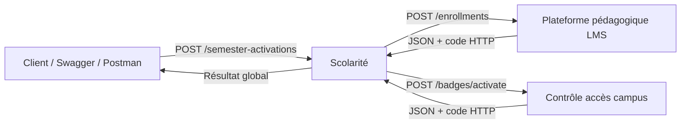
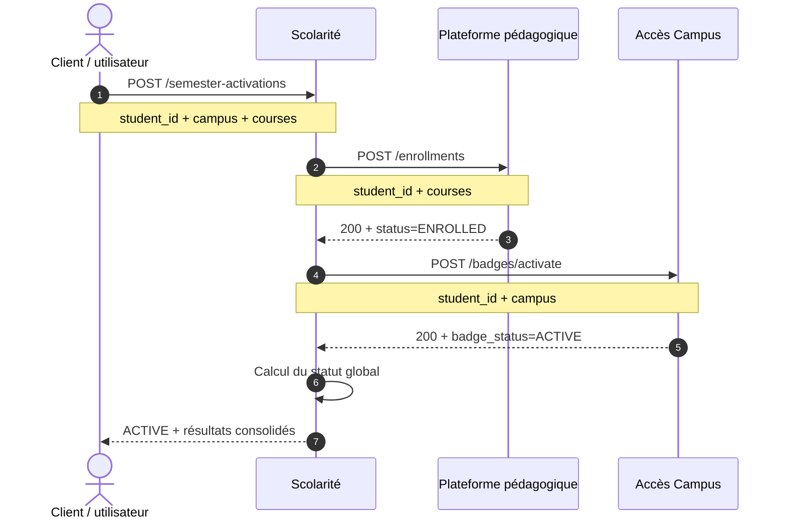
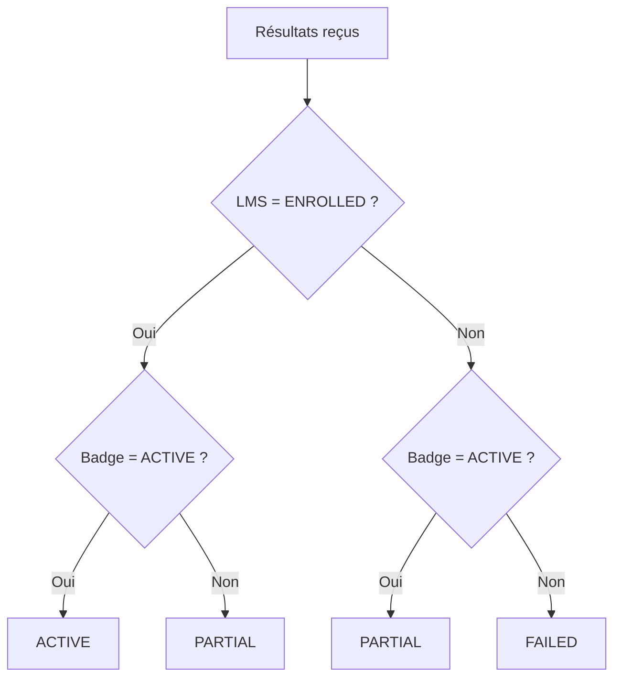
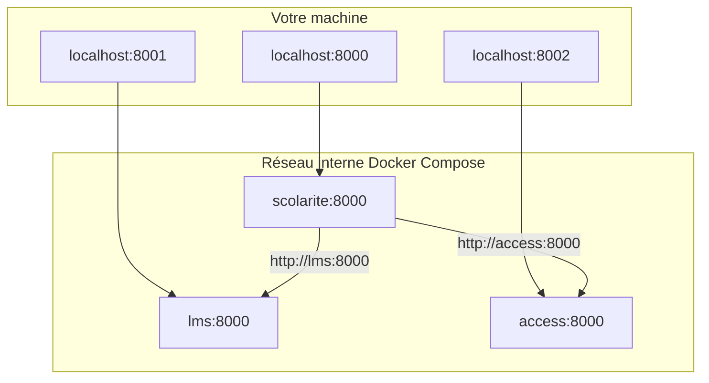
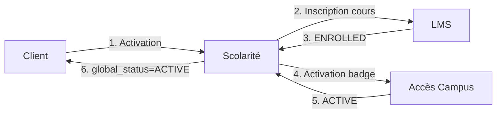
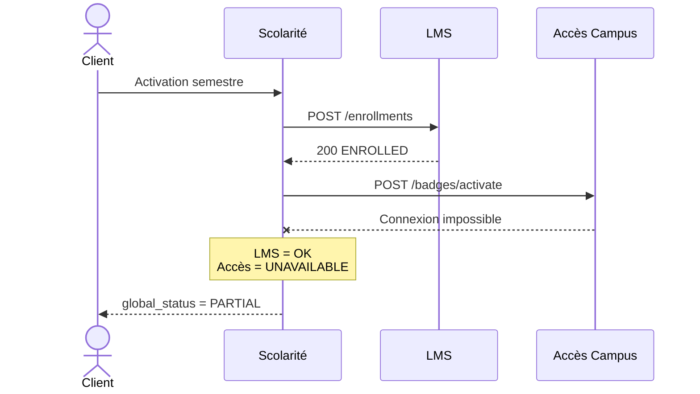
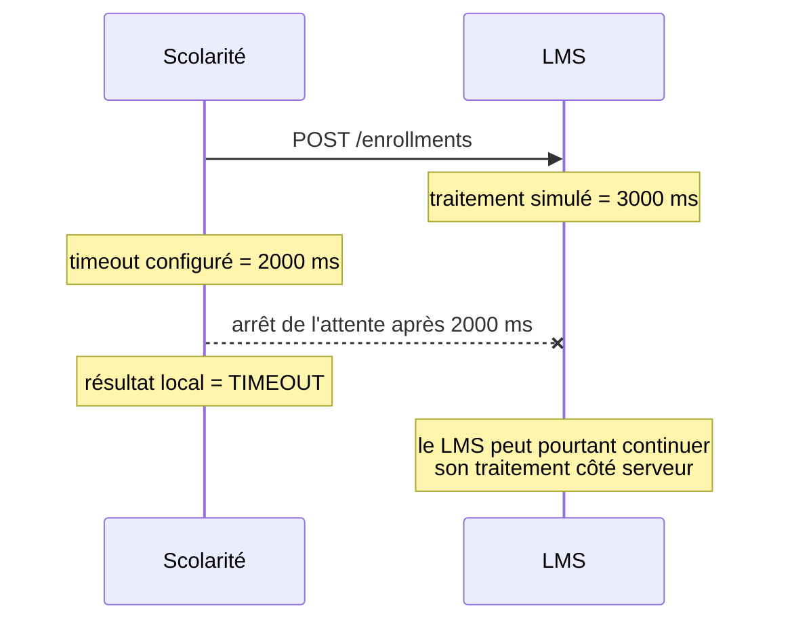
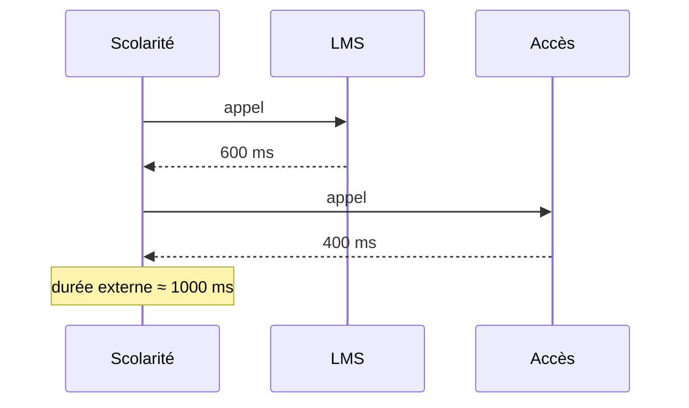
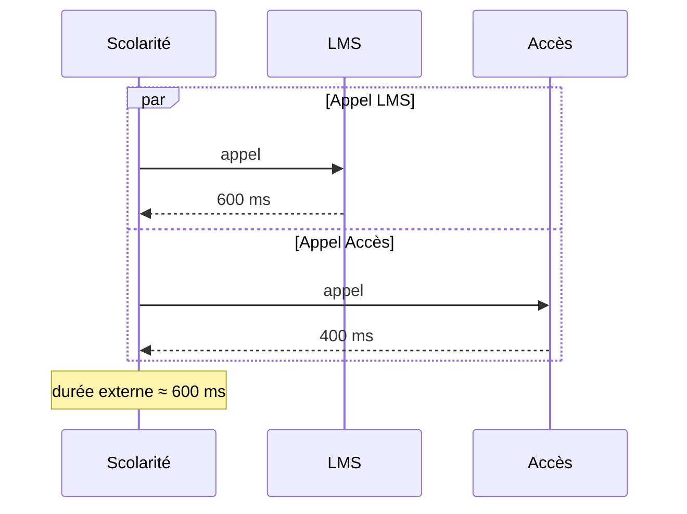

# TP NOTÉ - Échanges API entre plusieurs systèmes d’un SI d'école

## Coordination entre Scolarité, Plateforme pédagogique et Contrôle d’accès

**Niveau :** intermédiaire

**Durée maximale :** 3 heures

**Barème :** /20

**Travail :** individuel 

**Rendu principal :** un **rapport PDF** illustré, argumenté et structuré

**Technologies :** **Python 3.11+**, **FastAPI**, **HTTPX**, **Docker**, **Docker Compose**, **JSON**, **HTTP** 

**Outils autorisés pour les tests :** **Swagger**, **`curl`**, **Postman**, **PowerShell**, **navigateur** 

---

# 1. Objectif général du TP

Dans ce **TP**, vous n’allez pas apprendre à créer une **API CRUD** classique.

Le sujet porte sur une problématique plus proche d’un **système d’information réel** :

> **comment plusieurs applications indépendantes échangent-elles entre elles lorsqu’un même processus métier traverse plusieurs systèmes ?**

Vous allez travailler sur un **SI d'école** composé de plusieurs applications autonomes.

Chaque application possède sa propre responsabilité.

Elles doivent cependant collaborer lorsqu’un étudiant est activé pour un semestre.

**Votre travail consistera à** :

- démarrer plusieurs systèmes ;
- observer leurs échanges ;
- comprendre le rôle de chaque application ;
- tester un scénario nominal ;
- provoquer une panne partielle ;
- provoquer une latence ;
- observer un timeout ;
- analyser les conséquences ;
- proposer une amélioration d’architecture ;
- produire un rapport **PDF** expliquant ce que vous avez observé.

---

# 1.1 Comment lire ce sujet

Le code fourni est volontairement **très commenté**.

**Les commentaires ont quatre objectifs** :

```text
1. expliquer ce que fait l'instruction ;
2. expliquer pourquoi elle est nécessaire ;
3. préciser ce qui circule entre les systèmes ;
4. attirer votre attention sur les erreurs possibles.
```

**Lorsque vous voyez un commentaire comme** :

```python
# Appel du LMS depuis la Scolarité.
response = await client.post(...)
```

vous ne devez pas simplement retenir la syntaxe **Python**.

**Vous devez être capables d'expliquer dans votre rapport** :

> « **La Scolarité** agit comme cliente **HTTP** du **LMS**. Elle transmet une partie des données reçues de l'utilisateur à un autre système du **SI**. »

Le code est donc un **support d'analyse des échanges inter-systèmes**.

---

# 2. Contexte métier

L’école utilise plusieurs applications.

## 2.1 Système de Scolarité

**Le système de Scolarité gère notamment** :

- l’identité administrative de l’étudiant ;
- son activation pour le semestre ;
- son campus de rattachement ;
- les enseignements auxquels il doit être inscrit.

Dans ce **TP**, la Scolarité joue aussi le rôle de **coordinateur**.

Elle reçoit la demande initiale puis contacte les autres systèmes.

---

## 2.2 Plateforme pédagogique

La plateforme pédagogique représente un **LMS**, par exemple un équivalent simplifié de **Moodle**.

**Elle gère** :

- les inscriptions aux cours ;
- les groupes pédagogiques ;
- l’accès aux contenus.

Elle ne connaît pas directement l’état du badge campus.

---

## 2.3 Contrôle d’accès campus

**Ce système gère** :

- les badges ;
- l’accès aux bâtiments ;
- l’activation ou la désactivation du badge.

Il ne gère ni les cours ni les inscriptions pédagogiques.

---

# 3. Pourquoi séparer ces systèmes ?

Dans un **SI réel**, il est fréquent que plusieurs applications soient spécialisées.

**Par exemple** :

```text
la Scolarité sait qu’un étudiant est inscrit
mais ne gère pas le badge physique

la plateforme pédagogique connaît les cours
mais ne gère pas l’identité administrative complète

le système d’accès campus sait ouvrir une porte
mais ne connaît pas la liste des enseignements
```

**Cette séparation permet** :

- de répartir les responsabilités ;
- de faire évoluer chaque application indépendamment ;
- d’utiliser des technologies différentes ;
- de limiter les dépendances directes aux bases de données des autres systèmes.

**Mais cette architecture introduit aussi des difficultés** :

- latence ;
- pannes partielles ;
- données incohérentes temporairement ;
- dépendances réseau ;
- erreurs de contrat ;
- problèmes de timeout.

C’est précisément ce que vous allez observer.

---

# 4. Processus métier étudié

**Lorsqu’un étudiant est activé pour un semestre** :

```text
1. Un utilisateur envoie une demande à la Scolarité.

2. La Scolarité transmet les cours de l’étudiant
   à la plateforme pédagogique.

3. La plateforme pédagogique inscrit l’étudiant.

4. La Scolarité transmet l’identité et le campus
   au système de contrôle d’accès.

5. Le système d’accès active le badge.

6. La Scolarité construit une réponse globale
   à partir des résultats reçus.
```

---

# 5. Architecture du TP



---

# 5.1 Vue détaillée des échanges



### Lecture du diagramme

Remarquez que la Scolarité ne transmet pas exactement le même **JSON** aux deux applications.

**Le LMS reçoit** :

```text
student_id
courses
```

**alors qu'Accès Campus reçoit** :

```text
student_id
campus
```

La Scolarité joue donc également un rôle de **transformation et de routage des données**.

---

# 6. Ce que vous devez comprendre avant de commencer

Dans cette architecture, l’utilisateur ne contacte pas directement les trois systèmes.

**Il contacte uniquement** :

```text
Scolarité
```

La Scolarité agit comme un **orchestrateur**.

Elle décide quelles autres applications doivent être appelées.

Cela signifie qu’une seule demande utilisateur peut provoquer plusieurs échanges internes.

**Exemple** :

```text
1 requête externe
peut générer
2 requêtes internes
```

Vous devez donc raisonner sur le flux complet et pas seulement sur **une requête HTTP isolée**.

---

# 7. Résultat métier global

**La Scolarité** retourne trois états globaux possibles.

## ACTIVE

```text
LMS réussi
ET
badge activé
```

---

## PARTIAL

```text
un système a réussi
mais l’autre a échoué
```

---

## FAILED

```text
les deux systèmes externes ont échoué
```

---

# 7.1 Décision du statut global



Ce diagramme représente la logique métier codée dans **la Scolarité**.

---

# 8. Organisation recommandée des 3 heures

| Étape | Temps conseillé |
|---|---:|
| Lecture + lancement | 25 min |
| Tests individuels | 20 min |
| Flux complet | 35 min |
| Analyse logs | 15 min |
| Panne partielle | 25 min |
| Latence + timeout | 25 min |
| Amélioration technique | 15 min |
| Rapport PDF | 20 min |
| **Total** | **3 h** |

> Vous êtes responsables de votre gestion du temps. Ne passez pas plus de 20 minutes sur une difficulté de configuration sans avancer sur l’analyse.

---

# 9. Arborescence attendue

**Votre projet doit suivre cette structure** :

```text
tp-api-ecole/
|
|-- docker-compose.yml
|
|-- scolarite/
|   |-- Dockerfile
|   |-- requirements.txt
|   |-- main.py
|
|-- lms/
|   |-- Dockerfile
|   |-- requirements.txt
|   |-- main.py
|
|-- access/
|   |-- Dockerfile
|   |-- requirements.txt
|   |-- main.py
|
|-- rapport/
```

---

# 10. Création du projet

## Linux / macOS

```bash
mkdir -p tp-api-ecole/{scolarite,lms,access,rapport}
cd tp-api-ecole
```

## Windows PowerShell

```powershell
mkdir tp-api-ecole
cd tp-api-ecole

mkdir scolarite
mkdir lms
mkdir access
mkdir rapport
```

---

# 11. Dépendances

**Créer dans chacun des trois services un fichier** :

```text
requirements.txt
```

**Contenu** :

```txt
fastapi
uvicorn[standard]
httpx
```

### Explication

- `fastapi` : permet de créer l’**API** ;
- `uvicorn` : exécute l’application ;
- `httpx` : permet à un système d’appeler un autre système par **HTTP**.

Dans ce **TP**, `httpx` est surtout important dans **la Scolarité** car cette application joue le rôle d’orchestrateur.

---

# 12. Dockerfile commun

**Créez le fichier suivant dans chacun des dossiers** :

```text
scolarite/
lms/
access/
```

```dockerfile
# -------------------------------------------------------------------
# Image de base
# -------------------------------------------------------------------
#
# On part d'une image Python officielle légère.
# Chaque système possède sa propre image et donc son propre environnement.
FROM python:3.12-slim


# -------------------------------------------------------------------
# Répertoire de travail
# -------------------------------------------------------------------
#
# Toutes les commandes suivantes seront exécutées depuis /app.
WORKDIR /app


# -------------------------------------------------------------------
# Dépendances
# -------------------------------------------------------------------
#
# On copie requirements.txt AVANT le code.
# Cela permet à Docker de réutiliser son cache si les dépendances
# ne changent pas.
COPY requirements.txt .

RUN pip install --no-cache-dir -r requirements.txt


# -------------------------------------------------------------------
# Code applicatif
# -------------------------------------------------------------------
COPY main.py .


# -------------------------------------------------------------------
# Démarrage
# -------------------------------------------------------------------
#
# --host 0.0.0.0 est important dans Docker.
# Si l'application écoutait uniquement sur 127.0.0.1,
# elle ne serait pas accessible depuis l'extérieur du conteneur.
#
# Tous les services utilisent 8000 DANS leur conteneur.
# Les ports différents 8000/8001/8002 sont définis ensuite
# dans docker-compose.yml sur la machine hôte.
CMD ["uvicorn","main:app","--host","0.0.0.0","--port","8000"]
```

---

# 13. Pourquoi tous les services écoutent-ils sur 8000 ?

Chaque conteneur possède son propre espace réseau.

**Ainsi** :

```text
LMS peut utiliser 8000
Accès peut utiliser 8000
Scolarité peut utiliser 8000
```

à l’intérieur de **Docker**.

**C’est seulement sur votre machine que nous publions différents ports** :

```text
Scolarité -> localhost:8000
LMS       -> localhost:8001
Accès     -> localhost:8002
```

---

# 14. Service Plateforme pédagogique

**Créez** :

```text
lms/main.py
```

```python
# ================================================================
# lms/main.py
# ================================================================
#
# Ce service représente la plateforme pédagogique.
#
# IMPORTANT :
# il ne connaît pas le fonctionnement interne de la Scolarité.
# Il connaît uniquement le CONTRAT d'échange défini par son endpoint.
# ================================================================

import asyncio

from fastapi import FastAPI, HTTPException, Query
from pydantic import BaseModel


# Création de l'application HTTP du LMS.
app = FastAPI(
    title="Plateforme pédagogique API",
    version="1.0"
)


class EnrollmentRequest(BaseModel):
    """
    Contrat JSON attendu depuis la Scolarité.

    Exemple reçu :

    {
        "student_id": "ETU-2026-001",
        "courses": ["Cloud", "Architecture SI"]
    }

    Pydantic vérifie que :
    - student_id est une chaîne ;
    - courses est une liste de chaînes.

    Si la Scolarité envoie un format incompatible,
    FastAPI retournera automatiquement une erreur de validation.
    """

    student_id: str
    courses: list[str]


@app.get("/health")
async def health():
    """
    Endpoint technique.

    Il permet de vérifier rapidement que le service
    est démarré et répond correctement.
    """

    return {
        "service": "lms",
        "status": "ok"
    }


@app.post("/enrollments")
async def create_enrollment(
    payload: EnrollmentRequest,

    # delay_ms permettra de simuler un système lent.
    delay_ms: int = Query(
        default=0,
        ge=0,
        le=5000
    ),

    # fail permettra de simuler une erreur serveur.
    fail: bool = False
):
    """
    Inscrit virtuellement un étudiant à ses cours.
    """

    # -----------------------------------------------------
    # Simulation volontaire d'une latence
    # -----------------------------------------------------

    if delay_ms > 0:

        # asyncio.sleep simule ici un traitement externe lent.
        #
        # Exemple :
        # delay_ms=3000
        # => le LMS attend environ 3 secondes avant de répondre.
        #
        # Ce délai nous permettra ensuite d'observer
        # la propagation de latence vers la Scolarité.
        await asyncio.sleep(
            delay_ms / 1000
        )


    # -----------------------------------------------------
    # Simulation volontaire d'une panne
    # -----------------------------------------------------

    if fail:

        raise HTTPException(
            status_code=500,
            detail=(
                "Erreur simulée de la "
                "plateforme pédagogique"
            )
        )


    # -----------------------------------------------------
    # Cas nominal
    # -----------------------------------------------------

    return {
        "student_id":
            payload.student_id,

        "courses":
            payload.courses,

        "status":
            "ENROLLED"
    }
```

---

# 15. Ce que vous devez observer dans ce service

**Le LMS** expose volontairement des comportements contrôlables.

**Vous pouvez tester** :

```text
cas nominal
```

**mais aussi** :

```text
latence
erreur HTTP 500
```

Ce mécanisme est utilisé uniquement pour le **TP** afin de reproduire des situations réelles.

---

# 16. Service Accès Campus

**Créez** :

```text
access/main.py
```

```python
# ================================================================
# access/main.py
# ================================================================
#
# Ce service représente un système totalement différent du LMS.
#
# Il reçoit un autre sous-ensemble des données :
# - student_id
# - campus
#
# Il ne reçoit PAS la liste des cours.
# ================================================================

from fastapi import FastAPI, HTTPException
from pydantic import BaseModel


app = FastAPI(
    title="Accès Campus API",
    version="1.0"
)


class BadgeRequest(BaseModel):
    """
    Données attendues depuis la Scolarité.
    """

    student_id: str
    campus: str


@app.get("/health")
async def health():

    return {
        "service": "campus-access",
        "status": "ok"
    }


@app.post("/badges/activate")
async def activate_badge(
    payload: BadgeRequest,
    fail: bool = False
):
    """
    Active virtuellement le badge d'un étudiant.
    """

    if fail:

        raise HTTPException(
            status_code=503,
            detail=(
                "Système de badge "
                "temporairement indisponible"
            )
        )

    return {
        "student_id":
            payload.student_id,

        "campus":
            payload.campus,

        "badge_status":
            "ACTIVE"
    }
```

---

# 17. Pourquoi utiliser 503 ici ?

**Le code** :

```text
503 Service Unavailable
```

signifie qu’un service est temporairement indisponible.

**Il est donc plus adapté ici qu’un simple** :

```text
500 Internal Server Error
```

car nous voulons simuler une indisponibilité temporaire du système de badge.

---

# 18. Service Scolarité

**Créez** :

```text
scolarite/main.py
```

```python
# ================================================================
# scolarite/main.py
# ================================================================
#
# Ce service est le coeur du TP.
#
# Il possède DEUX rôles :
#
# 1. serveur HTTP vis-à-vis de l'utilisateur ;
# 2. client HTTP vis-à-vis du LMS et d'Accès Campus.
#
# Une même application peut donc être :
# - appelée par un système ;
# - puis appeler elle-même d'autres systèmes.
# ================================================================

import os
import time

# HTTPX joue ici le rôle du client HTTP inter-systèmes.
import httpx

from fastapi import FastAPI
from pydantic import BaseModel


app = FastAPI(
    title="Scolarité API",
    version="1.0"
)


# -------------------------------------------------------------------
# URLs internes Docker
# -------------------------------------------------------------------

# Depuis le conteneur Scolarité,
# localhost désignerait le conteneur Scolarité lui-même.
#
# Pour contacter un autre service Docker,
# on utilise son nom réseau.
LMS_URL = os.getenv(
    "LMS_URL",
    "http://lms:8000"
)

ACCESS_URL = os.getenv(
    "ACCESS_URL",
    "http://access:8000"
)


class SemesterActivationRequest(BaseModel):
    """
    Requête reçue depuis l'utilisateur.
    """

    student_id: str
    campus: str
    courses: list[str]


@app.get("/health")
async def health():

    return {
        "service": "scolarite",
        "status": "ok"
    }


@app.post("/semester-activations")
async def activate_semester(
    payload: SemesterActivationRequest
):
    """
    Orchestration complète du processus.

    La Scolarité :
    1. contacte le LMS ;
    2. contacte le système d'accès ;
    3. combine les résultats ;
    4. produit un statut global.
    """

    # Début de mesure du temps total.
    started = time.perf_counter()


    # -----------------------------------------------------
    # Timeout
    # -----------------------------------------------------

    # Une dépendance externe ne doit pas pouvoir
    # bloquer indéfiniment l'application.
    # La Scolarité refuse d'attendre indéfiniment une dépendance.
    #
    # Ici :
    # - le LMS dispose au maximum de 2 secondes pour répondre ;
    # - Accès Campus dispose également de 2 secondes.
    #
    # Si le délai est dépassé, HTTPX lève TimeoutException.
    #
    # Le timeout ne signifie donc PAS forcément que le service est mort.
    # Il signifie que la réponse n'est pas arrivée dans le budget prévu.
    timeout = httpx.Timeout(
        2.0
    )


    # -----------------------------------------------------
    # Variables de résultats
    # -----------------------------------------------------

    lms_result = None
    access_result = None


    # =====================================================
    # APPEL 1 : LMS
    # =====================================================

    try:

        async with httpx.AsyncClient(
            timeout=timeout
        ) as client:

            # -------------------------------------------------
            # ECHANGE INTER-SYSTEMES N°1
            # -------------------------------------------------
            #
            # La Scolarité devient ici CLIENT HTTP du LMS.
            #
            # Elle ne transmet que les données nécessaires
            # à la plateforme pédagogique.
            lms_response = await client.post(
                f"{LMS_URL}/enrollments",

                # HTTPX sérialise automatiquement ce dictionnaire
                # en JSON et ajoute Content-Type: application/json.
                json={
                    "student_id":
                        payload.student_id,

                    "courses":
                        payload.courses
                }
            )

        # Si LMS répond 4xx ou 5xx,
        # HTTPX déclenche une HTTPStatusError.
        lms_response.raise_for_status()

        # Transformation du JSON reçu
        # en dictionnaire Python.
        lms_result = lms_response.json()


    except httpx.TimeoutException:

        # CAS 1 : le LMS n'a pas répondu dans le délai autorisé.
        #
        # Il peut être :
        # - lent ;
        # - surchargé ;
        # - bloqué ;
        # - confronté à un problème réseau.
        #
        # La Scolarité continue néanmoins son propre traitement.
        lms_result = {
            "status": "TIMEOUT"
        }


    except httpx.HTTPStatusError as exc:

        # CAS 2 : le LMS a BIEN répondu au niveau réseau,
        # mais sa réponse HTTP indique une erreur (4xx ou 5xx).
        #
        # C'est différent d'un timeout ou d'une connexion refusée.
        lms_result = {
            "status": "ERROR",
            "http_status":
                exc.response.status_code
        }


    except httpx.RequestError:

        # CAS 3 : la communication réseau elle-même échoue.
        #
        # Exemples :
        # - conteneur LMS arrêté ;
        # - connexion refusée ;
        # - nom DNS introuvable ;
        # - problème réseau.
        #
        # Aucun résultat métier LMS n'est alors disponible.
        lms_result = {
            "status": "UNAVAILABLE"
        }


    # =====================================================
    # APPEL 2 : ACCES CAMPUS
    # =====================================================

    try:

        async with httpx.AsyncClient(
            timeout=timeout
        ) as client:

            # -------------------------------------------------
            # ECHANGE INTER-SYSTEMES N°2
            # -------------------------------------------------
            #
            # Cette fois, la Scolarité appelle un autre domaine :
            # le contrôle d'accès.
            #
            # Notez que la liste des cours n'est pas transmise,
            # car elle n'a aucune utilité pour ce système.
            access_response = await client.post(
                f"{ACCESS_URL}/badges/activate",

                json={
                    "student_id":
                        payload.student_id,

                    "campus":
                        payload.campus
                }
            )

        access_response.raise_for_status()

        access_result = (
            access_response.json()
        )


    except httpx.TimeoutException:

        access_result = {
            "status": "TIMEOUT"
        }


    except httpx.HTTPStatusError as exc:

        access_result = {
            "status": "ERROR",
            "http_status":
                exc.response.status_code
        }


    except httpx.RequestError:

        access_result = {
            "status": "UNAVAILABLE"
        }


    # =====================================================
    # CALCUL DU STATUT GLOBAL
    # =====================================================

    lms_ok = (
        lms_result.get("status")
        == "ENROLLED"
    )

    access_ok = (
        access_result.get(
            "badge_status"
        )
        == "ACTIVE"
    )


    # La Scolarité traduit deux réponses techniques/métier
    # en un état fonctionnel global compréhensible par le client.
    #
    # Cette logique est une décision d'orchestration.
    if lms_ok and access_ok:

        # Les deux systèmes ont confirmé leur traitement.
        global_status = "ACTIVE"

    elif lms_ok or access_ok:

        # Un seul traitement a réussi :
        # le SI se trouve dans un état partiellement cohérent.
        global_status = "PARTIAL"

    else:

        # Aucun des deux traitements n'a abouti.
        global_status = "FAILED"


    # =====================================================
    # TEMPS TOTAL
    # =====================================================

    duration_ms = (
        time.perf_counter()
        - started
    ) * 1000


    # =====================================================
    # REPONSE CONSOLIDEE
    # =====================================================

    return {
        "student_id":
            payload.student_id,

        "global_status":
            global_status,

        "lms":
            lms_result,

        "campus_access":
            access_result,

        "duration_ms":
            round(
                duration_ms,
                2
            )
    }
```

---

# 19. Ce que fait réellement la Scolarité

Vous devez être capable d’expliquer les quatre étapes suivantes.

## Étape 1

**Elle reçoit** :

```json
{
  "student_id": "...",
  "campus": "...",
  "courses": []
}
```

---

## Étape 2

Elle extrait les données nécessaires au **LMS**.

**Elle lui envoie seulement** :

```json
{
  "student_id": "...",
  "courses": []
}
```

---

## Étape 3

Elle extrait les données nécessaires au système d’accès.

**Elle lui envoie** :

```json
{
  "student_id": "...",
  "campus": "..."
}
```

---

## Étape 4

Elle reconstruit une réponse unique à partir de plusieurs réponses.

**C’est ce qu’on appelle ici une** :

```text
réponse consolidée
```

---

# 20. Docker Compose

**Créez** :

```text
docker-compose.yml
```

```yaml
# ===============================================================
# docker-compose.yml
# ===============================================================
#
# Docker Compose crée automatiquement un réseau commun.
#
# Les noms des services deviennent des noms DNS :
#
#   lms        -> adresse du conteneur LMS
#   access     -> adresse du conteneur Accès
#   scolarite  -> adresse du conteneur Scolarité
#
# Le fichier décrit donc à la fois :
# - quels conteneurs doivent être lancés ;
# - comment ils sont construits ;
# - quelles variables ils reçoivent ;
# - quels ports sont publiés vers votre PC.
# ===============================================================

services:

  # =======================================================
  # SCOLARITE
  # =======================================================

  scolarite:

    # L'image est construite depuis ./scolarite/Dockerfile.
    build:
      context: ./scolarite

    environment:

      # Ces adresses sont INTERNAL Docker.
      #
      # La Scolarité n'utilise pas localhost pour joindre
      # les autres conteneurs.
      LMS_URL: http://lms:8000
      ACCESS_URL: http://access:8000

    ports:
      # gauche  = port de votre machine
      # droite  = port dans le conteneur
      - "8000:8000"

    # depends_on indique l'ordre de démarrage.
    #
    # ATTENTION :
    # cela ne garantit pas à lui seul que l'application LMS
    # soit déjà totalement prête à traiter une requête.
    depends_on:
      - lms
      - access


  # =======================================================
  # LMS
  # =======================================================

  lms:

    build:
      context: ./lms

    ports:
      - "8001:8000"


  # =======================================================
  # ACCES CAMPUS
  # =======================================================

  access:

    build:
      context: ./access

    ports:
      - "8002:8000"
```

---

# 21. Comprendre les adresses

**Depuis votre machine** :

```text
Scolarité
http://localhost:8000

LMS
http://localhost:8001

Accès
http://localhost:8002
```

**Mais depuis la Scolarité** :

```text
LMS
http://lms:8000

Accès
http://access:8000
```

---

# 22. Pourquoi cette différence ?

`localhost` signifie toujours :

```text
la machine sur laquelle le programme s'exécute
```

**Dans le conteneur Scolarité** :

```text
localhost = conteneur Scolarité
```

et non votre **PC**.

**Docker fournit donc un DNS interne permettant d’utiliser** :

```text
lms
access
scolarite
```

comme noms d’hôtes.

---

# 22.1 Réseau Docker à comprendre



### Point important

**Les ports** :

```text
8001
8002
```

servent à votre machine pour accéder aux conteneurs.

Ils ne sont pas nécessaires pour la communication interne entre les services.

**À l'intérieur du réseau Docker** :

```text
Scolarité -> lms:8000
Scolarité -> access:8000
```

Cette distinction devra être expliquée dans votre rapport.

---

# 23. PARTIE A - Lancement de l’architecture - 2,5 points

## Travail demandé

**Lancez** :

```bash
docker compose up -d --build
```

**Puis** :

```bash
docker compose ps
```

---

## Résultat attendu

Vous devez voir trois services actifs.

---

## Vérifiez ensuite

```text
http://localhost:8000/health
http://localhost:8001/health
http://localhost:8002/health
```

---

## Capture obligatoire 1

**Capturez** :

```text
docker compose ps
```

avec les trois services actifs.

---

## Question A1 - 0,5 point

**Expliquez précisément pourquoi la Scolarité utilise** :

```text
http://lms:8000
```

**au lieu de** :

```text
http://localhost:8001
```

dans son code interne.

---

## Question A2 - 0,5 point

**Quelle différence faites-vous entre** :

```text
port interne du conteneur
```

**et** :

```text
port publié sur la machine hôte
```

---

# 24. PARTIE B - Tests directs des systèmes externes - 2,5 points

Avant de tester le processus global, vous allez tester les deux systèmes séparément.

**L’objectif est de vérifier** :

```text
chaque brique indépendamment
```

---

# 25. Test LMS

**Ouvrez** :

```text
http://localhost:8001/docs
```

**Testez** :

```text
POST /enrollments
```

**avec** :

```json
{
  "student_id": "ETU-2026-001",
  "courses": [
    "Architecture SI",
    "Cloud",
    "Data"
  ]
}
```

---

## Résultat attendu

```json
{
  "student_id": "ETU-2026-001",
  "courses": [
    "Architecture SI",
    "Cloud",
    "Data"
  ],
  "status": "ENROLLED"
}
```

---

# 26. Test Accès Campus

**Ouvrez** :

```text
http://localhost:8002/docs
```

**Envoyez** :

```json
{
  "student_id": "ETU-2026-001",
  "campus": "Nanterre"
}
```

---

## Résultat attendu

```json
{
  "student_id": "ETU-2026-001",
  "campus": "Nanterre",
  "badge_status": "ACTIVE"
}
```

---

## Capture obligatoire 2

Ajoutez une capture lisible d’un appel direct réussi vers **le LMS** ou **Accès Campus**.

---

## Question B1 - 0,5 point

Pourquoi tester les systèmes séparément avant l’orchestration complète facilite-t-il le diagnostic en cas d’erreur ?

---

# 27. PARTIE C - Flux inter-systèmes complet - 4 points

**Ouvrez** :

```text
http://localhost:8000/docs
```

**Exécutez** :

```text
POST /semester-activations
```

**avec** :

```json
{
  "student_id": "ETU-2026-001",
  "campus": "Nanterre",
  "courses": [
    "Architecture SI",
    "Cloud",
    "Data"
  ]
}
```

---

# 28. Résultat attendu

**Vous devez obtenir une réponse ressemblant à** :

```json
{
  "student_id": "ETU-2026-001",
  "global_status": "ACTIVE",
  "lms": {
    "student_id": "ETU-2026-001",
    "courses": [
      "Architecture SI",
      "Cloud",
      "Data"
    ],
    "status": "ENROLLED"
  },
  "campus_access": {
    "student_id": "ETU-2026-001",
    "campus": "Nanterre",
    "badge_status": "ACTIVE"
  },
  "duration_ms": 35.42
}
```

La durée dépend de votre machine.

---

# 29. Analyse attendue

**Vous devez expliquer que** :

```text
le client n’a envoyé qu’une requête
```

**mais que la Scolarité a déclenché** :

```text
un appel vers LMS
+
un appel vers Accès Campus
```

Puis elle a consolidé les deux réponses.

---

## Capture obligatoire 3

**Capture de la réponse contenant** :

```text
global_status = ACTIVE
```

---

# 30. Observer les logs

**Exécutez** :

```bash
docker compose logs -f
```

**ou** :

```bash
docker compose logs -f scolarite
```

Relancez ensuite une activation.

---

## Capture obligatoire 4

Capturez les logs pendant un échange.

---

## Question C1 - 1 point

**Décrivez le chemin complet d’une demande en utilisant obligatoirement les termes suivants** :

```text
client
Scolarité
LMS
Accès Campus
réponse consolidée
```

---

## Question C2 - 0,5 point

Pourquoi peut-on dire que la Scolarité est couplée au **LMS** et au système d’accès, même si les trois applications ont des bases et des responsabilités séparées ?

---

# 30.1 Diagramme du scénario nominal



Le point important est que le résultat final dépend de plusieurs réponses intermédiaires.

---

# 31. PARTIE D - Panne partielle - 4 points

Vous allez maintenant observer un cas plus réaliste.

Tous les systèmes ne tombent pas forcément ensemble.

**Nous allons arrêter uniquement** :

```text
Accès Campus
```

---

# 32. Arrêter le service

```bash
docker compose stop access
```

**Vérifiez** :

```bash
docker compose ps
```

---

# 33. Relancer une activation

**Envoyez** :

```json
{
  "student_id": "ETU-2026-002",
  "campus": "Nanterre",
  "courses": [
    "Architecture SI",
    "Cloud"
  ]
}
```

---

# 34. Ce que vous devez observer

**Le LMS** continue de fonctionner.

**La Scolarité** ne peut plus joindre **Accès Campus**.

**La réponse devrait contenir** :

```json
{
  "status": "UNAVAILABLE"
}
```

pour le système d’accès.

**Le résultat global doit être** :

```text
PARTIAL
```

---

## Capture obligatoire 5

Capturez la réponse `PARTIAL`.

---

## Question D1 - 1 point

Pourquoi `PARTIAL` est-il plus précis que `FAILED` dans ce scénario ?

---

## Question D2 - 1 point

À ce moment précis, **le SI** est-il cohérent ?

**Discutez brièvement l’état suivant** :

```text
étudiant inscrit sur le LMS
mais
badge non activé
```

---

## Question D3 - 0,5 point

Proposez une stratégie possible pour traiter cette situation ultérieurement.

**Exemples possibles** :

- retry ;
- traitement manuel ;
- file de messages ;
- tâche planifiée ;
- événement asynchrone.

Justifiez votre choix.

---

# 34.1 Diagramme de panne partielle



### Ce que vous devez analyser

Le système n'est ni complètement réussi ni complètement échoué.

**Il existe désormais une différence entre** :

```text
état LMS
et
état badge
```

C'est un exemple simple de **cohérence partielle dans un SI distribué**.

---

# 35. Redémarrer Accès Campus

```bash
docker compose start access
```

---

# 36. PARTIE E - Latence et timeout - 3,5 points

Nous allons maintenant étudier un problème différent.

**Le LMS** ne tombe pas.

**Il répond simplement** :

```text
trop lentement
```

---

# 37. Modifier temporairement l’appel LMS

**Dans** :

```text
scolarite/main.py
```

**remplacez** :

```python
f"{LMS_URL}/enrollments"
```

**par** :

```python
f"{LMS_URL}/enrollments?delay_ms=3000"
```

---

# 38. Pourquoi 3000 ms ?

**Le LMS attendra** :

```text
3 secondes
```

avant de répondre.

**Mais la Scolarité possède** :

```python
timeout = httpx.Timeout(2.0)
```

**Elle n’attendra donc que** :

```text
2 secondes
```

---

# 39. Rebuild

```bash
docker compose up -d --build scolarite
```

---

# 40. Relancer l’activation

Observez le résultat.

**Le LMS doit être représenté par** :

```json
{
  "status": "TIMEOUT"
}
```

---

## Capture obligatoire 6

**Capture montrant clairement** :

```text
TIMEOUT
```

---

# 40.1 Diagramme du timeout



### Point avancé

Un timeout côté client ne garantit pas que l'opération distante n'a pas été exécutée.

**Dans des SI plus critiques, cette situation peut nécessiter** :

```text
idempotence
identifiant de requête
reconciliation
```

Vous n'avez pas à les implémenter ici, mais vous devez comprendre le problème.

---

# 41. Analyse du timeout

**Un timeout ne signifie pas nécessairement** :

```text
le serveur est éteint
```

**Il signifie** :

```text
le client a attendu plus longtemps
que la durée maximale autorisée
```

Le serveur peut être encore vivant.

---

## Question E1 - 0,5 point

**Expliquez la différence entre** :

```text
TIMEOUT
```

**et** :

```text
UNAVAILABLE
```

dans ce **TP**.

---

## Question E2 - 0,5 point

Pourquoi un timeout trop long peut-il dégrader tout **le SI** ?

Donnez au moins deux conséquences.

---

## Question E3 - 0,5 point

**Si l’on réduisait le timeout à** :

```text
100 ms
```

serait-ce forcément mieux ?

Expliquez.

---

# 42. PARTIE F - Niveau plus avancé : séquentiel ou parallèle ? - 1,5 point

**Dans le code actuel** :

```text
appel LMS
puis
appel Accès Campus
```

Les appels sont donc séquentiels.

---

# 43. Question F1 - 0,5 point

**Si le LMS prend** :

```text
600 ms
```

**et Accès Campus** :

```text
400 ms
```

quelle latence approximative ajoute l’orchestration séquentielle ?

---

# 44. Question F2 - 0,5 point

Dans ce scénario, les deux appels dépendent-ils l’un de l’autre ?

**Autrement dit** :

```text
faut-il connaître la réponse LMS
avant d’activer le badge ?
```

Justifiez.

---

# 45. Amélioration possible

**Si les deux opérations sont indépendantes, on pourrait envisager** :

```python
asyncio.gather(...)
```

afin d’exécuter les deux appels en parallèle.

---

## Question F3 - 0,5 point

Quel avantage principal cela apporterait-il ?

Quel risque ou inconvénient cela pourrait-il introduire ?

---

# 45.1 Séquentiel vs parallèle

### Version actuelle



### Version parallèle possible



Dans ce cas simplifié, les opérations sont indépendantes.

L'exécution parallèle peut réduire la latence totale, mais elle entraîne aussi davantage de travail simultané sur les systèmes distants.

---

# 46. PARTIE G - Proposition d’amélioration d’architecture - 1 point

Choisissez **une seule** amélioration parmi :

```text
client HTTP partagé
retry limité
correlation ID
idempotency key
appels parallèles
file de messages
journalisation structurée
```

**Dans votre rapport** :

1. définissez l’amélioration ;
2. expliquez où vous l’ajouteriez ;
3. expliquez quel problème elle résout.

---

# 47. PARTIE H - Questions de synthèse - 1 point

Répondez brièvement.

---

## H1 - 0,25 point

**Les trois systèmes doivent-ils utiliser** :

```text
le même langage
```

pour communiquer ?

Pourquoi ?

---

## H2 - 0,25 point

Peuvent-ils utiliser des bases de données différentes ?

---

## H3 - 0,25 point

Quel est l’un des avantages principaux de cette séparation en plusieurs systèmes ?

---

## H4 - 0,25 point

Quel est l’un des principaux inconvénients d’**un SI distribué** ?

---

# 48. Rapport PDF obligatoire

**Votre livrable principal est** :

```text
NOM_Prenom_TP_Echanges_SI.pdf
```

Le rapport doit être lisible, structuré et argumenté.

---

# 49. Taille recommandée

**Environ** :

```text
6 à 10 pages
```

hors annexes éventuelles.

L’objectif n’est pas de produire un document très long.

**L’objectif est de démontrer que vous avez** :

```text
réalisé
observé
compris
analysé
```

---

# 50. Structure obligatoire du PDF

## Page de garde

**Indiquez** :

- nom ;
- prénom ;
- groupe ;
- date ;
- intitulé du TP.

---

## 1. Présentation de l’architecture

**Expliquez** :

- rôle de la Scolarité ;
- rôle du **LMS** ;
- rôle d’**Accès Campus** ;
- rôle de **Docker**.

Ajoutez un schéma.

---

## 2. Mise en place

**Incluez** :

```text
Capture 1
```

**et expliquez** :

- quels conteneurs sont actifs ;
- quels ports sont publiés.

---

## 3. Tests directs

Incluez :

```text
Capture 2
```

Expliquez ce que vous avez envoyé et reçu.

---

## 4. Flux complet

**Incluez** :

```text
Captures 3 et 4
```

**Expliquez précisément** :

```text
qui appelle qui
quelles données circulent
comment le statut ACTIVE est calculé
```

---

## 5. Panne partielle

**Incluez** :

```text
Capture 5
```

**Expliquez** :

- ce qui fonctionne encore ;
- ce qui ne fonctionne plus ;
- pourquoi l’état est **PARTIAL** ;
- ce que cela implique sur la cohérence globale.

---

## 6. Latence et timeout

**Incluez** :

```text
Capture 6
```

**Expliquez** :

```text
LMS = 3000 ms
timeout Scolarité = 2000 ms
```

Puis analysez le résultat.

---

## 7. Analyse avancée

**Répondez aux questions** :

```text
séquentiel vs parallèle
timeout
retry
cohérence
résilience
```

---

## 8. Amélioration proposée

Présentez l’amélioration de votre choix.

---

## 9. Conclusion

Environ **8** à **12 lignes**.

**Répondez notamment à** :

```text
qu’avez-vous appris sur les échanges inter-systèmes ?
```

---

# 51. Captures obligatoires

| N° | Capture attendue |
|---|---|
| 1 | `docker compose ps` |
| 2 | Appel direct **LMS** ou Accès |
| 3 | Flux complet `ACTIVE` |
| 4 | Logs de l’échange |
| 5 | Panne partielle `PARTIAL` |
| 6 | **Timeout LMS** |

---

# 52. Comment présenter une capture

**Mauvaise présentation** :

```text
capture seule
sans texte
```

**Bonne présentation** :

```text
Figure 5 - Activation en panne partielle

Le service Accès Campus a été arrêté.
Le LMS répond encore correctement.
La Scolarité retourne donc PARTIAL.
```

---

# 52.1 Exemple d'analyse attendue

**Une bonne analyse ne se limite pas à** :

> « J'ai arrêté le conteneur et ça a affiché **PARTIAL**. »

**Une réponse plus pertinente serait** :

> « Après l'arrêt d'Accès Campus, **la Scolarité** continue à joindre **le LMS**, qui retourne `ENROLLED`. L'appel vers `access:8000` échoue au niveau réseau et est traduit par **la Scolarité** en `UNAVAILABLE`. Comme un seul des deux sous-processus a réussi, l'orchestrateur retourne `PARTIAL`. L'étudiant se trouve donc temporairement dans un état fonctionnel incohérent : inscrit pédagogiquement mais sans badge actif. »

C'est ce niveau d'explication qui est attendu.

---

# 53. Ce qui sera évalué dans les explications

**Nous ne cherchons pas uniquement** :

```text
"ça marche"
```

**Nous cherchons votre capacité à expliquer** :

```text
pourquoi
comment
avec quelles conséquences
```

---

# 54. Barème complet

| Partie | Points |
|---|---:|
| A - Lancement + compréhension Docker | 2,5 |
| B - Tests directs | 2,5 |
| C - Flux complet | 4 |
| D - Panne partielle | 4 |
| E - Latence / timeout | 3,5 |
| F - Séquentiel / parallèle | 1,5 |
| G - Amélioration d’architecture | 1 |
| H - Synthèse | 1 |
| **Total** | **20** |

---

# 55. Critères qualitatifs

**Dans toutes les parties, seront aussi évalués** :

- précision du vocabulaire ;
- qualité des captures ;
- qualité des explications ;
- capacité d’analyse ;
- cohérence technique ;
- capacité à distinguer une erreur réseau d’une erreur **HTTP** ;
- capacité à expliquer une panne partielle ;
- capacité à relier une observation à une notion d’architecture.

---

# 56. Commandes utiles

## Démarrage

```bash
docker compose up -d --build
```

---

## Etat

```bash
docker compose ps
```

---

## Logs

```bash
docker compose logs
```

---

## Logs temps réel

```bash
docker compose logs -f
```

---

## Logs Scolarité

```bash
docker compose logs -f scolarite
```

---

## Arrêter Accès

```bash
docker compose stop access
```

---

## Redémarrer Accès

```bash
docker compose start access
```

---

## Rebuild Scolarité

```bash
docker compose up -d --build scolarite
```

---

## Tout arrêter

```bash
docker compose down
```

---

# 57. Test PowerShell

```powershell
$body = @{
    student_id = "ETU-2026-001"
    campus = "Nanterre"
    courses = @(
        "Architecture SI",
        "Cloud",
        "Data"
    )
} | ConvertTo-Json

Invoke-RestMethod `
    -Method Post `
    -Uri "http://localhost:8000/semester-activations" `
    -ContentType "application/json" `
    -Body $body
```

---

# 58. Test curl Linux/macOS

```bash
curl -X POST \
  http://localhost:8000/semester-activations \
  -H "Content-Type: application/json" \
  -d '{
    "student_id": "ETU-2026-001",
    "campus": "Nanterre",
    "courses": [
      "Architecture SI",
      "Cloud",
      "Data"
    ]
  }'
```

---

# 58.1 Tableau de diagnostic à utiliser

Lorsque vous analysez un problème, distinguez bien les cas suivants :

| Situation | Le serveur répond ? | Exemple local | Interprétation |
|---|---|---|---|
| Succès | Oui | **HTTP 200** | traitement réussi |
| Erreur **HTTP** | Oui | **HTTP 500/503** | serveur joignable mais traitement en erreur |
| Timeout | Pas dans le délai | `TIMEOUT` | réponse trop lente |
| Indisponible | Non | `UNAVAILABLE` | connexion/réseau/service impossible |

Ce tableau peut être repris dans votre rapport si vous l'expliquez avec vos propres observations.

---

# 59. Concepts à connaître pour le rapport

**Vous devez être capables d’utiliser correctement les termes suivants** :

```text
orchestration
appel inter-systèmes
contrat JSON
code HTTP
panne partielle
timeout
latence
service indisponible
réponse consolidée
cohérence
résilience
DNS Docker
```

---

# 60. Notion : contrat d’échange

**Deux applications doivent s’accorder sur** :

```text
URL
méthode HTTP
champs JSON
types
codes HTTP
sens métier
```

**Exemple** :

```json
{
  "student_id": "ETU-2026-001",
  "courses": [
    "Cloud"
  ]
}
```

---

# 61. Que se passe-t-il si le contrat change ?

**Si le LMS remplace** :

```text
student_id
```

**par** :

```text
student_number
```

**sans coordination avec Scolarité** :

```text
l’intégration peut casser
```

---

# 62. Notion : panne partielle

**Un système distribué peut être** :

```text
partiellement fonctionnel
```

**Exemple** :

```text
Scolarité OK
LMS OK
Accès KO
```

**Ce n’est pas exactement** :

```text
SI totalement indisponible
```

---

# 63. Notion : propagation de latence

**Dans un échange synchrone** :

```text
Scolarité attend LMS
```

**Donc** :

```text
LMS lent
=> Scolarité lente
=> utilisateur attend
```

---

# 64. Notion : timeout

**Le timeout limite** :

```text
combien de temps un système accepte d’attendre
```

Cela protège les ressources.

Mais un timeout trop court peut provoquer des erreurs inutiles.

---

# 65. Notion : résilience

**Un système résilient ne signifie pas** :

```text
aucune panne
```

**Cela signifie plutôt** :

```text
le système gère les pannes de manière contrôlée
```

**Exemples** :

```text
timeout
retry
fallback
état PARTIAL
file de messages
```

---

# 66. Notion : orchestration synchrone

**Dans ce TP** :

```text
Scolarité
```

**connaît explicitement** :

```text
LMS
Accès Campus
ordre des appels
interprétation des réponses
```

Cela simplifie la compréhension.

Mais cela crée aussi davantage de dépendance autour de l’orchestrateur.

---

# 67. Pour aller plus loin

**Dans une architecture plus avancée, on pourrait ajouter** :

- **RabbitMQ** ;
- **Kafka** ;
- **retry avec backoff** ;
- **circuit breaker** ;
- **idempotence** ;
- **correlation ID** ;
- **logs structurés** ;
- **appels parallèles** ;
- **observabilité** ;
- **files de compensation**.

Ces éléments ne sont pas tous demandés dans **ce TP** de **3 heures**.

---

# 68. Conclusion générale du sujet

**Ce TP doit vous faire comprendre qu’une API n’est pas seulement** :

```text
un endpoint à tester dans Swagger
```

**Dans un SI distribué, une API devient surtout** :

> **un contrat de communication entre plusieurs applications autonomes.**

**Dès que plusieurs systèmes collaborent, il faut raisonner sur** :

```text
le chemin des données
les dépendances
les erreurs
la latence
les timeouts
la cohérence
la résilience
```

Votre rapport devra démontrer que vous savez analyser le **comportement global du SI**, et pas uniquement exécuter des commandes.
